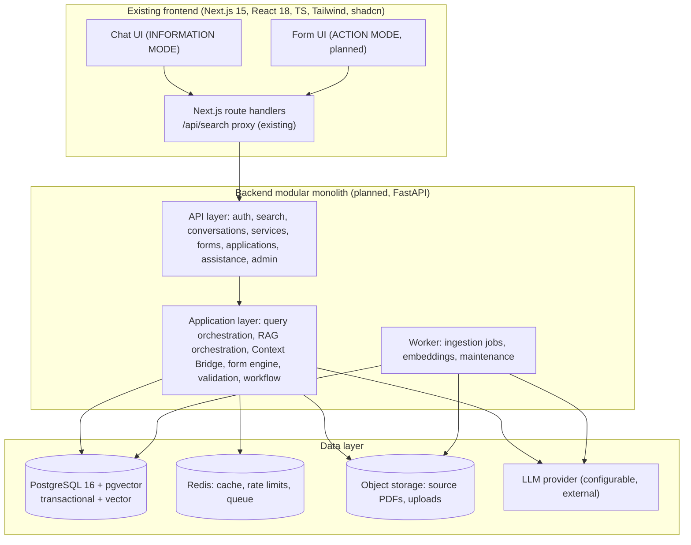
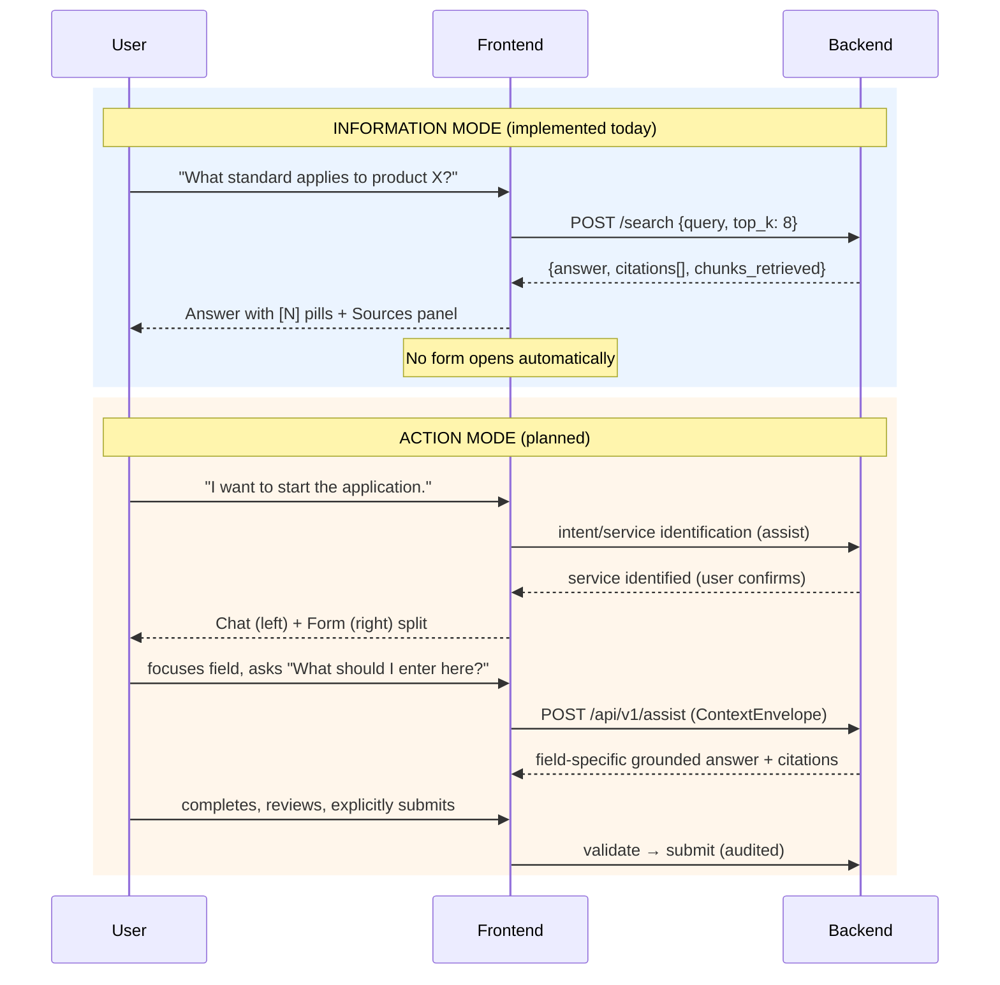

# 00 — Project Overview

**Project:** BIS AI — AI-powered Intelligent Assistant for Indian Standards and BIS Services for Industries and Consumers
**Repository family:** BIS-SIH ("BIS Chat" frontend + new backend)
**Document status:** Technical blueprint (prototype / Smart India Hackathon project)
**Related documents:** see [01 Product Requirements](./01_PRODUCT_REQUIREMENTS.md) through [23 Traceability Matrix](./23_TRACEABILITY_MATRIX.md)

---

## 1. Purpose

This document is the high-level entry point into the complete technical documentation set for BIS AI. It describes the problem, the users, the product concept (Information Mode + Action Mode + Context Bridge), the current state of the frontend, the planned backend, and the MVP boundary. Every claim about the **existing frontend** in this set is derived from `FRONTEND_CODEBASE_ANALYSIS.md`, which is the source of truth for current frontend behavior. Claims that are not verified are explicitly marked `UNKNOWN`, `ASSUMPTION`, or listed in [22 Open Decisions](./22_OPEN_DECISIONS.md).

## 2. Problem Statement

Businesses and consumers in India must navigate the Bureau of Indian Standards (BIS) ecosystem — thousands of Indian Standards (IS), certification schemes, hallmarking rules, laboratory recognition, and consumer services. Today this information is scattered across PDFs, portals, and informal knowledge. A manufacturer does not know which standard applies to a product; a consumer cannot tell whether a hallmark is genuine or what a BIS service requires; an applicant filling a BIS form has no contextual help and abandons the process. Generic chatbots answer from unverified web text and cannot cite authoritative evidence, and no assistant walks a user from "I have a question" to "I completed the application" in one continuous, grounded experience.

## 3. Target Users

| User category | Primary need | Notes |
|---|---|---|
| Consumer | Verify hallmarks/ISI marks, understand rights, find consumer services | Frontend already offers this role in a static select (not persisted, not enforced) |
| Manufacturer | Find applicable standards, apply for product certification | Primary Action Mode user |
| Laboratory / testing organization | Recognition, testing scope information, applications | |
| Regulator / government officer | Reference lookups, review (future) | Review workflows are future scope |
| Researcher / Student | Standards discovery, citation-backed answers | Heavy Vault users |
| Admin (backend role, new) | Knowledge ingestion, service/form management, audit review | Backend-only role; no frontend admin UI exists today |

Roles do **not** share identical permissions. See [06 Auth & RBAC](./06_AUTH_AND_RBAC.md). The frontend currently has role UI/mock state only; it does not enforce any role.

## 4. Product Vision

Evolve the existing grounded Q&A assistant from **ASK → ANSWER** to:

```
ASK → UNDERSTAND → ANSWER → ACT → COMPLETE
```

Two product modes make this safe:

- **INFORMATION MODE** — user asks a BIS question; the system retrieves authorized knowledge and answers with citations. The system must **never** automatically open a form just because a related service exists.
- **ACTION MODE** — user *explicitly* indicates they want to perform a BIS service/application task (e.g., "I want to start the application"); only then is the service/form experience opened, alongside the conversation (chat left, form right).

The **Context Bridge** is the central architectural concept: the AI understands Conversation Context + Service Context + Form Context + Current Field Context simultaneously, so that "What should I enter here?" is answered for the field the user is actually looking at. Full design: [11 Context Bridge](./11_CONTEXT_BRIDGE.md).

## 5. Core Capabilities

1. Natural-language BIS questions with source-grounded answers and clickable `[N]` citations (exists in frontend today, backend contract preserved).
2. Standards discovery and explanation (clause/section-level evidence is a planned enrichment).
3. BIS service discovery (catalogue; new).
4. Certification guidance, hallmarking information, testing/laboratory information (knowledge layer; new).
5. Explicit Action Mode transition to a schema-driven BIS form (new).
6. Field-level AI assistance inside forms, evidence-backed, never auto-submitting (new).
7. Draft persistence, server-side validation, application workflow with audit trail (new).
8. Conversation persistence on the server (migration from localStorage; new).
9. Knowledge ingestion pipeline for versioned BIS documents (new).
10. Multilingual interaction (conceptual design now; post-MVP implementation — see [§22](#22-mvp-scope) and [07 AI/RAG](./07_AI_RAG_ARCHITECTURE.md)).

## 6. Information Mode (current, preserved)

```
User question → POST /search → retrieval over authorized BIS knowledge
            → grounded answer (markdown with [N] markers) → citations panel → vault save
```

No form opens automatically. This is the only mode the current frontend implements, and the backend must keep it working unchanged (see [§9](#9-current-frontend-state) and [05 API Specification](./05_API_SPECIFICATION.md)).

## 7. Action Mode (planned)

```
User: "I want to apply for product certification."
  → detect ACTION intent
  → identify service (Service Catalogue)
  → show service summary → user confirms
  → open form (Chat | Form split view)
  → establish Context Bridge (service/form/field context)
  → user fills form; asks field questions; assistant explains with citations
  → server-side validation → draft resumable → user reviews → explicit submit
  → hand-off to external BIS workflow (integration: TBD / requires verification)
```

The system does not auto-submit, does not silently change user-entered data, and does not fabricate BIS requirements. See [14 Form Copilot](./14_BIS_FORM_COPILOT.md), [15 Validation & Workflow](./15_VALIDATION_AND_WORKFLOW.md).

## 8. High-Level Architecture

**Decision: modular monolith** for the prototype (see [03 Backend Architecture](./03_BACKEND_ARCHITECTURE.md) for rationale and module boundaries). One deployable backend service, internally partitioned into modules with strict boundaries, plus a worker process for background jobs.



## 9. Current Frontend State

Summary from `FRONTEND_CODEBASE_ANALYSIS.md` (authoritative for the frontend):

- **Stack:** Next.js 15 App Router (`^15.3.4`), React 18, TypeScript 5.8 (`strict: false`), Tailwind 3, 47 shadcn/Radix primitives, `react-resizable-panels`, `react-markdown`. TanStack Query installed but unused; `react-hook-form` + `zod` installed but only referenced by the unused `ui/form.tsx` primitive.
- **Implemented:** INFORMATION MODE chat — single non-streamed `POST /search` per question; `ChatMessage[]` local state; `AnswerCard` renders `[N]` as clickable pills; `SourcesPanel` slide-over receives `(citations, queryContext)`; history (50-item cap) and Vault (tags/collections/BibTeX+PDF export) in **localStorage only** (`bis-sih_history`, `bis-sih_vault`, `bis-sih_collections`); settings/help/account UI is mock (toasts only).
- **The only real network call:** `POST {NEXT_PUBLIC_API_BASE_URL || "/api"}/search` with body `{"query": string, "top_k": 8}`, `Content-Type: application/json`, **no auth headers, no timeout**. Same-origin proxy `src/app/api/search/route.ts` forwards the body verbatim to `${BIS_SIH_API_BASE_URL || NEXT_PUBLIC_API_BASE_URL || "http://127.0.0.1:8000"}/search` and returns `502 {detail}` on transport failure.
- **Exact backend-facing types (`src/types/api.ts`):**

```ts
export type SourceType = "bis" | "iso" | "iec";
export interface Citation { index: number; title: string; source_type: SourceType; chunk_text: string; score: number; mongo_id: string; }
export interface QueryResponse { answer: string; citations: Citation[]; query: string; model: string; chunks_retrieved: number; mode: string; }
```

- **Mock SSE:** `GET /api/chat` emits `chunk-1..5` then `done`; nothing consumes it. Streaming intent only — no streaming renderer exists in the UI.
- **Does NOT exist:** auth, roles enforcement, service catalogue, forms, applications, field context, Context Bridge, file upload, server persistence, TanStack Query data fetching, zod schemas in app code.
- **Reusable for ACTION MODE:** `PanelGroup` split (chat|sources today), `onOpenSources(citations, queryContext)` context-passing pattern (nearest analogue of the Context Bridge), 47 form-capable primitives, `StoreContext` composition point for new hooks (`useBISService`, `useFormDraft`).

**Current frontend gaps:** authentication, service catalogue, form models, field context, server persistence, Context Bridge, file upload. See [01 Product Requirements](./01_PRODUCT_REQUIREMENTS.md) §Frontend compatibility and [23 Traceability Matrix](./23_TRACEABILITY_MATRIX.md).

## 10. Planned Backend

| Aspect | Decision | Status |
|---|---|---|
| Architecture | Modular monolith (FastAPI, Python 3.11+) + separate worker process | DECIDED (rationale in 03) |
| API surface | Legacy `POST /search` preserved verbatim; new versioned surface under `/api/v1/*` | DECIDED |
| Transactional DB | PostgreSQL 16 | DECIDED |
| Vector search | pgvector extension (separate vector DB is a future option) | DECIDED (OD-010 records the alternative) |
| Cache/queue/rate-limit | Redis 7 | DECIDED |
| Object storage | S3-compatible (MinIO in dev) | DECIDED |
| Auth | Email+password, Argon2id, opaque server-side session in HttpOnly cookie; OAuth/OIDC future | DECIDED for prototype (OD-011 records alternatives) |
| LLM | Provider-agnostic gateway (OpenAI-compatible protocol); actual provider UNKNOWN | ASSUMPTION + OD-007 |
| Embeddings | Configurable; dimension is a deployment parameter | OD-008 |
| Audit | Append-only `audit_logs` for sensitive operations | DECIDED |

Backend responsibilities and requirements: [02 Backend PRD](./02_BACKEND_PRD.md).

## 11. AI/RAG Layer

Retrieval-Augmented Generation with mandatory citation validation: intent detection → query normalization → hybrid retrieval (pgvector dense + lexical) → metadata filtering (source trust, document version, service/form scope) → optional reranking → context assembly → generation → **citation validation against retrieved chunk IDs** → response. Retrieved documents are treated as DATA, never as instructions. The assistant must express uncertainty rather than invent standards, clauses, or requirements. Full design: [07 AI/RAG Architecture](./07_AI_RAG_ARCHITECTURE.md).

The existing citation model (`index, title, source_type, chunk_text, score, mongo_id`) is preserved; richer metadata (page, clause, section, document version, evidence span, URL) is **additive** so the current frontend keeps working. Citation architecture: [07 §11](./07_AI_RAG_ARCHITECTURE.md).

## 12. BIS Knowledge Layer

Versioned knowledge model: `Source` (registry entry with trust level) → `Document` → `DocumentVersion` (immutable) → `DocumentChunk` (+ embedding, section/clause/page metadata). Knowledge content is ingested through a controlled pipeline ([09 Document Ingestion](./09_DOCUMENT_INGESTION.md)); **no automatic access to BIS systems is assumed** and no official BIS APIs are claimed (see [22 Open Decisions](./22_OPEN_DECISIONS.md) OD-015/OD-016).

## 13. Service/Form Layer

A generic, data-driven catalogue of BIS services (`Service`, `ServiceCategory`, `ServiceVersion`) each optionally bound to a versioned schema-driven form (`Form`, `FormVersion`, `FormSection`, `FormField`, `FieldOption`). Services and forms are content, not code — new services are added without backend code changes. Applications are typed against an immutable `FormVersion`. See [12 Service Catalogue](./12_BIS_SERVICE_CATALOGUE.md), [13 Form Engine](./13_BIS_FORM_ENGINE.md).

## 14. Context Bridge

A formal `ContextEnvelope` (schema `1.0`) carries conversation, user, service, form, field, application, and evidence context on assistance requests. Client-provided context is **untrusted input**: identifiers are verified server-side, values are user-provided data, and conversation content is treated as untrusted text (prompt-injection surface). Full schema, lifecycle, and security: [11 Context Bridge](./11_CONTEXT_BRIDGE.md).

## 15. Authentication

Currently **none** (frontend and backend). Planned: email+password registration/login, Argon2id hashing, opaque session tokens in `HttpOnly; Secure; SameSite=Lax` cookies, CSRF protection, RBAC with 7 roles, brute-force lockout, rate limiting. Greenfield on both ends; the frontend today sends no auth headers, so auth injection belongs in the `/api` proxy layer. Design + permission matrix: [06 Auth & RBAC](./06_AUTH_AND_RBAC.md).

## 16. Database

PostgreSQL 16 (+ pgvector) holds all transactional and knowledge data; Redis for cache/queue/rate limits; S3-compatible object storage for source PDFs and uploaded files. ~24 entities covering identity, conversations, knowledge, catalogue, forms, applications, validation, ingestion, audit. Full schema: [04 Database Design](./04_DATABASE_DESIGN.md).

## 17. Audit

Append-only audit log covering login/logout, queries, ingestion/publication, service/form changes, application create/update/validate/submit, and admin/permission actions, with actor, action, resource, before/after, request ID, result. No secrets are ever logged. Design: [16 Audit Logging](./16_AUDIT_LOGGING.md).

## 18. Security

Threat-modeled design covering authentication, authorization, input validation, AI-specific threats (prompt injection, indirect injection via retrieved documents, RAG poisoning), file upload safety, SSRF/XSS/CSRF/SQLi, secrets management, encryption in transit/at rest, rate limiting, PII handling, least privilege. Design: [17 Security](./17_SECURITY.md). Unified error model: [18 Error Handling](./18_ERROR_HANDLING.md).

## 19. Deployment

Dev (docker-compose), staging, production. MVP deployment is deliberately small (single compose stack or small VM), clearly separated from production-scale deployment. Design: [20 Deployment](./20_DEPLOYMENT.md).

## 20. Major Subsystems

| # | Subsystem | Purpose | Primary doc |
|---|---|---|---|
| 1 | Search & RAG | Grounded Q&A + citations | 07 |
| 2 | Knowledge base | Versioned BIS knowledge model | 08 |
| 3 | Ingestion | Controlled document pipeline | 09 |
| 4 | Conversation engine | Persistent conversations/messages | 10 |
| 5 | Context Bridge | Cross-surface AI context | 11 |
| 6 | Service catalogue | BIS services as data | 12 |
| 7 | Form engine | Schema-driven versioned forms | 13 |
| 8 | Form Copilot | Field-level AI assistance | 14 |
| 9 | Validation & workflow | Authoritative validation + lifecycle | 15 |
| 10 | Identity & RBAC | AuthN/AuthZ | 06 |
| 11 | Audit | Immutable action log | 16 |
| 12 | Admin & ingestion API | Knowledge/service management | 05 |

## 21. Information / Action Mode summary



## 22. MVP Scope

**MVP includes:** preserved `/search` compatibility; real RAG behind it; basic authentication; server-side conversation persistence; service catalogue (read APIs); **one** representative BIS service with a schema-driven form (illustrative placeholder schema, not a verified official BIS form); Context Bridge v1; field-level assistance (explanation only); server-side validation; draft save/resume; audit logging; ingestion pipeline (manual upload); automated tests; MVP deployment.

**Post-MVP / future:** streaming answers; multilingual expansion (English first in MVP); regulator review workflows; external BIS integration (adapter interface stub only); vault server-sync; file upload for applications; billing/API-keys (the current settings UI is mock and is **not** a requirement — see [§24](#24-explicit-non-goals)); usage metering.

Stage-by-stage plan: [21 Implementation Roadmap](./21_IMPLEMENTATION_ROADMAP.md).

## 23. Future Scope (beyond MVP)

1. Streaming chat (requires a new frontend renderer; today's UI is request/response).
2. Multilingual knowledge and responses (Hindi + Indian languages) — conceptual design in [07 §18](./07_AI_RAG_ARCHITECTURE.md).
3. Additional BIS services and verified official form schemas.
4. External integrations behind an adapter interface (`ExternalBisAdapter`) — all marked "TBD / requires verification".
5. Regulator/officer review tooling, notifications, webhook delivery.
6. Vault/history server-side sync and cross-device continuity.
7. Advanced evaluation harness (retrieval/regression benchmarking in CI).

## 24. Explicit Non-Goals

- This is **not** an official BIS system and is not described as officially integrated with BIS. Correct phrasing: "BIS-focused AI assistant", "BIS knowledge-grounded assistant", "prototype".
- No invented BIS APIs, endpoints, authentication mechanisms, internal systems, or automation capabilities. Unverified integrations are documented as "External integration — TBD / requires verification" and hidden behind an adapter interface.
- The backend will not silently modify user-entered application data, will not auto-submit applications, and will not auto-open forms from informational queries.
- The frontend will not be redesigned; existing contracts are preserved with additive evolution.
- Mock settings UI (billing, API keys, security log, notifications) is **not** treated as a backend requirement.
