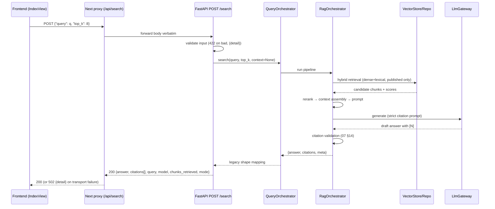
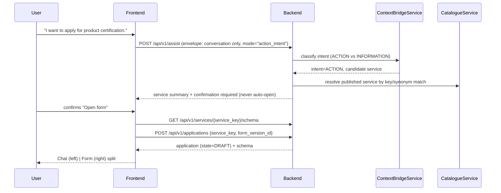
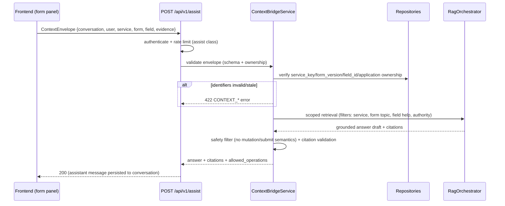
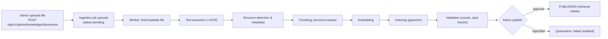
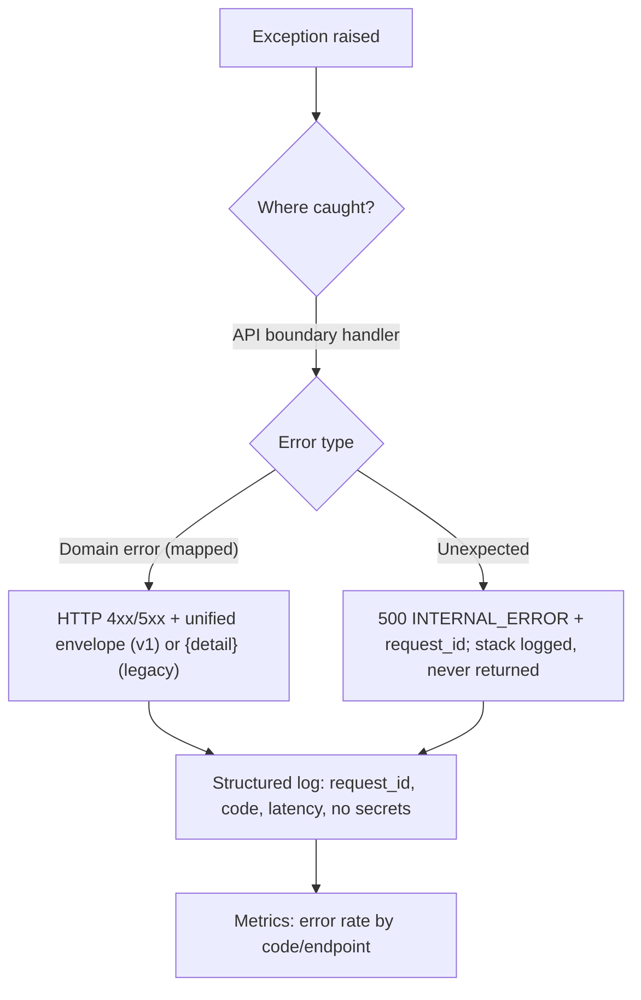

# 03 — Backend Architecture

**Related:** [02 Backend PRD](./02_BACKEND_PRD.md), [04 Database Design](./04_DATABASE_DESIGN.md), [05 API Specification](./05_API_SPECIFICATION.md)

---

## 1. Architecture Style: Modular Monolith (DECIDED)

**Decision:** a single deployable backend (modular monolith) + one worker process, not microservices.

**Why (actionable reasons, not vibes):**

1. **Team size & SIH timeline** — one to three developers cannot operate the overhead of distributed tracing, service discovery, inter-service auth, and per-service deploys. The monolith removes that entire failure class.
2. **Shared transactional boundary** — application creation + validation results + audit events must be transactionally consistent (04). In a monolith this is one DB transaction; in microservices it becomes sagas/outbox pattern for no MVP benefit.
3. **The RAG pipeline is latency-chained** — retrieval → rerank → generation is a single request path; splitting it across services adds network hops against NFR-001 latency targets.
4. **The existing upstream hints at it** — the frontend proxy targets one base URL (`http://127.0.0.1:8000`) implying a single Python service (inference, not evidence — recorded as OD-001/OD-002).
5. **Exit path exists** — module boundaries (§3) are enforced in code (separate packages, no cross-imports below the application layer, interface-typed infrastructure). Any module with divergent scaling needs (e.g., the worker) can be extracted later with minimal change: the worker is already a separate process.

**Explicit anti-goal:** microservices "for scalability". The MVP scaling lever is horizontal replication of the stateless API + worker, plus Postgres/Redis sizing (NFR-003/BE-NFR-004).

## 2. Technology Stack (backend)

| Concern | Choice | Notes |
|---|---|---|
| Language/framework | Python 3.11 + FastAPI | Async, Pydantic v2 validation at the boundary, OpenAPI generation |
| ORM/migrations | SQLAlchemy 2.x + Alembic | Explicit migrations, reviewed in PRs |
| Task queue | Redis + RQ (worker process) | Ingestion, embeddings, maintenance |
| Vector search | pgvector (HNSW index) | Same engine as transactional data (rationale in 04 §2) |
| Auth | Session middleware + RBAC dependency | 06 |
| Config | Pydantic Settings + `.env` | 12-factor; secrets via environment/secret store |
| Observability | structlog (JSON logs), Prometheus metrics, OpenTelemetry optional | 20 §8 |
| Testing | pytest + httpx; golden RAG eval harness | 19 |

## 3. Component Diagram

```mermaid
flowchart TB
    subgraph API["API layer (FastAPI routers) — thin: parse, authorize, delegate"]
        R1["auth"]
        R2["search"]
        R3["conversations"]
        R4["sources"]
        R5["services"]
        R6["forms"]
        R7["applications"]
        R8["assistance"]
        R9["admin"]
        R10["health"]
    end

    subgraph APP["Application layer (use-cases, framework-free)"]
        QO["QueryOrchestrator"]
        RAG["RagOrchestrator"]
        CB["ContextBridgeService"]
        FE["FormEngine"]
        VAL["ValidationService"]
        WF["WorkflowService"]
        CONV["ConversationService"]
        CAT["CatalogueService"]
        ID["IdentityService"]
        AUD["AuditService"]
        ING["IngestionService"]
    end

    subgraph INFRA["Infrastructure layer (interfaces + adapters)"]
        REPO["Repositories (SQLAlchemy)"]
        VEC["VectorStore (pgvector)"]
        OBJ["ObjectStore (S3)"]
        CACHE["Cache (Redis)"]
        QUEUE["Queue (Redis/RQ)"]
        LLM["LlmGateway"]
        EMB["EmbeddingProvider"]
        RR["Reranker"]
        BIS["ExternalBisAdapter (NoOp MVP)"]
        MAIL["MailAdapter"]
    end

    subgraph KNOW["Knowledge layer (domain concepts over data)"]
        DOCS["Documents / Versions"]
        CHUNKS["Chunks"]
        META["Metadata (section, clause, page, authority)"]
        REG["Source Registry (trust levels)"]
    end

    API --> APP
    QO --> RAG
    RAG --> VEC
    RAG --> LLM
    RAG --> EMB
    RAG --> RR
    RAG --> REG
    CB --> RAG
    CB --> FE
    QO --> CONV
    R8 --> CB
    R7 --> FE
    R7 --> VAL
    R7 --> WF
    WF --> AUD
    R5 --> CAT
    R9 --> ING
    ING --> QUEUE
    APP --> REPO
    APP --> CACHE
    ING --> OBJ
    ING --> EMB
    REPO --> PG[("PostgreSQL + pgvector")]
    VEC --> PG
    QUEUE --> RD[("Redis")]
    CACHE --> RD
```



Layer rules (enforced by lint/import contract):

- **API layer** never touches repositories or LLM directly.
- **Application layer** never imports FastAPI; it defines use-case functions and domain errors.
- **Infrastructure layer** implements interfaces defined by the application layer (dependency inversion).
- **Knowledge layer** is a domain view (services + types) over repositories/vector store, not a separate deployment.

## 4. Module Ownership Map (matches API router groups)

| Module | Owns | Key classes/services | Main doc |
|---|---|---|---|
| auth | sessions, login, registration, CSRF | `IdentityService`, session middleware | 06 |
| search | legacy + v1 search endpoints | `QueryOrchestrator` | 05 §3, 07 |
| conversations | conversation/message CRUD, lifecycle | `ConversationService` | 10 |
| sources | source registry reads (badge keys, trust) | `CatalogueService` (sources part) | 08 |
| services | public catalogue reads | `CatalogueService` | 12 |
| forms | schema reads (published versions) | `FormEngine.read` | 13 |
| applications | drafts, values, transitions, submit | `WorkflowService`, `ValidationService` | 15 |
| assistance | field/section assist | `ContextBridgeService` | 11, 14 |
| admin | knowledge, catalogue publishing, audit read | `IngestionService`, admin catalogue | 09, 12 |
| health | liveness/readiness | — | 20 §7 |

## 5. Request Flows

### 5.1 Legacy search flow (frozen contract)



Failure behavior: any pipeline failure returns non-2xx `{detail: "<stable message>"}` (no stack traces); empty retrieval returns 200 with `chunks_retrieved: 0` (frontend "empty" state).

### 5.2 v1 conversation ask flow (persistence on)

Same as 5.1 plus: create user message → on completion persist assistant message with citations JSONB inside one transaction → conversation `last_message_at` updated. Detail: [10 §4](./10_CONVERSATION_ENGINE.md).

### 5.3 Action Mode flow (service identification → form open)



Guardrails: ACTION intent detection only **proposes**; the UI requires explicit confirmation (principle #15/#16, [14 §3](./14_BIS_FORM_COPILOT.md)).

### 5.4 Form assistance flow (Context Bridge)



Full envelope schema & security: [11](./11_CONTEXT_BRIDGE.md).

### 5.5 Ingestion flow (worker)



Detail incl. retries/idempotency/duplicate detection: [09](./09_DOCUMENT_INGESTION.md).

### 5.6 Authentication flow

```mermaid
sequenceDiagram
    participant FE as Frontend
    participant API as Backend

    FE->>API: POST /api/v1/auth/login {email, password}
    API->>API: Argon2id verify; rate limit; lockout check
    alt success
        API->>API: create session row (opaque token, TTL)
        API-->>FE: Set-Cookie: bis_session=…; HttpOnly; Secure; SameSite=Lax
    else failure
        API-->>FE: 401 (stable message) + audit login.failure
    end
    FE->>API: any request (cookie attached same-origin via proxy)
    API->>API: session middleware → user → RBAC dependency → handler
```

Design/alternatives/permission matrix: [06](./06_AUTH_AND_RBAC.md).

### 5.7 Error flow



Error model & frontend behavior: [18](./18_ERROR_HANDLING.md).

## 6. Process Model & Scaling

| Process | Role | Scaling |
|---|---|---|
| `uvicorn` API (N workers) | Serves all HTTP | Horizontal replicas behind reverse proxy; stateless (session store in PG/Redis) |
| `rq` worker (N workers, queues: `ingest`, `embed`, `maintain`) | Ingestion pipeline, embeddings, cleanup | Scale by queue depth |
| PostgreSQL | Data + vectors | Vertical MVP; read replicas future |
| Redis | Cache/queue/rate-limit | Single instance MVP; sentinel future |

## 7. Key Architectural Decisions (summary)

| # | Decision | Rationale | Full doc |
|---|---|---|---|
| ADR-01 | Modular monolith | §1 | — |
| ADR-02 | Postgres+pgvector over separate vector DB | one engine, transactional consistency with chunks metadata, MVP scale (10⁵–10⁶ chunks); re-evaluate at scale | 04 §2 |
| ADR-03 | Session cookies over JWT for browser MVP | same-origin SPA, instant revocation, no token storage in JS; JWT documented as alternative | 06 §4 |
| ADR-04 | JSONB citations on messages (not normalized table) | read-heavy, shape evolves additively; analytics via event metrics | 04 §5 |
| ADR-05 | Applications have no separate drafts table | an application in `DRAFT` **is** the draft; avoids dual source of truth | 04 §5, 15 §2 |
| ADR-06 | Provider-agnostic LLM/embedding gateways | provider unknown (OD-007/008); swap without code change | 07 §3 |
| ADR-07 | Legacy path frozen, v1 additive | preserves running frontend (RULE 5) | 05 §2.6 |
| ADR-08 | Context envelope validated server-side | client context is untrusted input (principle #8) | 11 §6 |

## 8. Repository Layout (planned backend)

```text
backend/
├── app/
│   ├── api/            # routers (auth, search, conversations, services, forms, applications, assistance, admin, health)
│   ├── application/    # use-case services (framework-free) + domain errors
│   ├── domain/         # entities, enums (states, roles), value objects
│   ├── infra/          # db, vector, object store, cache, queue, llm, embeddings, reranker, adapters
│   ├── core/           # config, logging, security, errors, request context
│   └── main.py
├── worker/             # RQ workers: ingest.py, embed.py, maintenance.py
├── migrations/         # Alembic
├── tests/              # unit, integration, api, eval
└── pyproject.toml
```

## 9. Deployment View

See [20 Deployment](./20_DEPLOYMENT.md) for dev/staging/prod topology, env vars, backups, CI/CD, and the explicit MVP-vs-production split.
