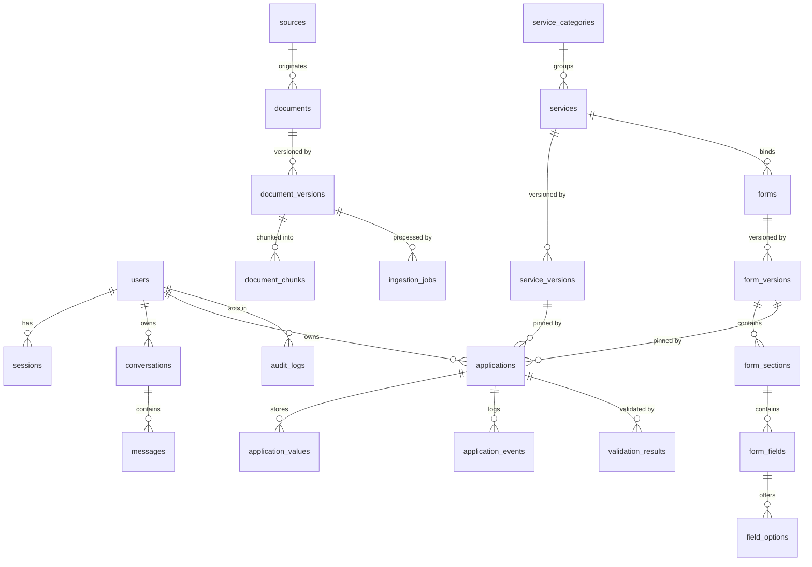

# 04 — Database Design

**Engine (DECIDED):** PostgreSQL 16 with the `pgvector` extension, plus Redis (cache/queue/rate-limit) and S3-compatible object storage. One relational engine holds **both** transactional and vector data; the separation below is logical, enforced by schema and query ownership, not by different engines.
**Related:** [03 Backend Architecture](./03_BACKEND_ARCHITECTURE.md), [05 API Specification](./05_API_SPECIFICATION.md), [08 Knowledge Base](./08_KNOWLEDGE_BASE.md), [13 Form Engine](./13_BIS_FORM_ENGINE.md), [15 Validation & Workflow](./15_VALIDATION_AND_WORKFLOW.md)

---

## 1. Data Domains (separation)

| Domain | Store | Contents | Access rules |
|---|---|---|---|
| **Transactional** | PostgreSQL (schema `app`) | users, roles, permissions, sessions, conversations, messages, services, forms, applications, application_values, application_events, validation_results, audit_logs, ingestion_jobs | Strong consistency, transactions, FKs |
| **Knowledge / vector** | PostgreSQL (schema `knowledge`) | sources, documents, document_versions, document_chunks (+ `embedding vector`, `fts tsvector`) | Write only via ingestion pipeline; read by retrieval; published-only visibility |
| **Object / file** | S3-compatible (MinIO dev) | original source PDFs/images; (future) user-uploaded application documents | Keys referencing DB rows; never queried directly by search |

Redis holds only ephemeral/derived state (cache entries, queues, rate-limit counters, schema cache). **Nothing in Redis is the sole copy of durable data.**

## 2. Why Postgres + pgvector (ADR-02)

1. Chunk metadata (document version, clause, section, authority) must filter vector search **with transactional joins** (e.g., published-version check); one engine avoids dual-write consistency bugs.
2. MVP scale is 10⁵–10⁶ chunks — well inside pgvector/HNSW capability; a dedicated vector DB is a scale optimization, recorded as future option (OD-010).
3. One backup/restore/audit surface; fewer moving parts for a prototype team.

## 3. Global Conventions

| Convention | Decision |
|---|---|
| Primary keys | `id uuid PRIMARY KEY DEFAULT gen_random_uuid()` — UUIDs because: multi-process ID generation without sequences, non-guessable public identifiers, safe merge/import of localStorage migration data |
| Public identifiers | Where URLs need human-readable stability: `service_key`, `form_key` (unique `text`, kebab-case); applications additionally get generated `application_number` (`APP-2026-000123`, from a Postgres sequence) |
| Naming | Tables plural snake_case; columns snake_case; JSON payloads also snake_case (matches existing frontend contract: `top_k`, `source_type`, `chunks_retrieved`) — no dual naming anywhere (RULE 7) |
| Timestamps | `created_at`, `updated_at` `timestamptz NOT NULL DEFAULT now()`; UTC only |
| Soft delete | `deleted_at timestamptz NULL` **only** on `users`, `conversations`, `messages` (GDPR-style removal + undo-able deletes). Versioned knowledge/catalogue rows use lifecycle `status` instead (never delete history). `audit_logs` are never deleted or updated |
| Versioning | `document_versions`, `service_versions`, `form_versions` are **immutable after publish**; edits create new draft rows |
| Optimistic concurrency | `applications.version integer` — PATCH requires `expected_version`; mismatch → 409 (multi-device draft editing). Published versions don't need it (immutable) |
| JSON fields | `messages.citations`, `messages.retrieval` (debug/eval), `form_versions.conditional_rules`/`validation_rules` (schema-owned), `application_values.value`, `applications.context_snapshot` — used where shape is schema-owned or additive-evolving; never for relational lookups |
| Enums | Postgres ENUMs for closed sets (states, roles, source_type, statuses) — typo-proof at DB level |
| Case sensitivity | All text search uses `citext` for emails; knowledge FTS via `tsvector` |

## 4. Entity Catalog

Legend: 🔒 = sensitive (see §8). Entities marked *(future)* are designed now, created in a later migration stage ([21 Roadmap](./21_IMPLEMENTATION_ROADMAP.md)).

### 4.1 Identity & Access

#### users
| Field | Type | Constraints | Notes |
|---|---|---|---|
| id | uuid | PK | |
| email | citext | UNIQUE NOT NULL | 🔒 PII; lowercased |
| password_hash | text | NOT NULL | 🔒 Argon2id; never logged/returned |
| display_name | text | NOT NULL | from frontend `bis-sih_display_name` migration |
| role_code | role_enum | NOT NULL DEFAULT 'consumer' | MVP single-role; M2M reserved (§5) |
| locale | text | NOT NULL DEFAULT 'en' | |
| status | user_status_enum | NOT NULL DEFAULT 'active' | active/suspended |
| deleted_at | timestamptz | NULL | soft delete |
| created_at / updated_at | timestamptz | NOT NULL | |

Indexes: `idx_users_email` (unique via constraint). Lifecycle: register → active; suspended by admin; soft-deleted on removal request. FKs referenced by sessions, conversations, applications, audit_logs.

#### roles / permissions / role_permissions
| roles | type | notes |
|---|---|---|
| code | text PK | consumer, manufacturer, laboratory, regulator, researcher, student, admin |
| name | text | display |
| description | text | |

| permissions | type | notes |
|---|---|---|
| code | text PK | e.g. `application:create`, `knowledge:ingest` (full matrix in 06 §7) |
| description | text | |

`role_permissions (role_code FK, permission_code FK, PK both)` — seeded by migration; matrix is the single source of truth for RBAC. **CURRENT frontend note:** role select in GeneralTab is unpersisted UI only; these tables are the planned enforcement model.

#### sessions
| Field | Type | Notes |
|---|---|---|
| id | uuid PK | |
| user_id | uuid FK→users | ON DELETE CASCADE |
| token_hash | text UNIQUE NOT NULL | 🔒 SHA-256 of opaque token; raw token only in cookie |
| csrf_token_hash | text NOT NULL | 🔒 double-submit pattern (06 §6) |
| user_agent_hash, ip_hash | text NULL | 🔒 pseudonymized for lockout analytics |
| expires_at | timestamptz NOT NULL | TTL 14 d, sliding refresh |
| revoked_at | timestamptz NULL | logout/revoke |
| created_at | timestamptz | |

Index: `(user_id)`, `(expires_at)` for cleanup job.

### 4.2 Conversations

#### conversations
| Field | Type | Notes |
|---|---|---|
| id | uuid PK | |
| user_id | uuid FK→users NOT NULL | ownership |
| title | text NOT NULL | generated server-side (mirrors `generateTitle`) |
| status | conversation_status_enum | active/archived |
| last_message_at | timestamptz NULL | list ordering |
| message_count | integer NOT NULL DEFAULT 0 | denormalized counter |
| metadata | jsonb NULL | e.g. origin surface (chat/form) |
| deleted_at | timestamptz NULL | soft delete |
| created_at / updated_at | | |

Indexes: `(user_id, last_message_at DESC)`. Lifecycle: created on first v1 ask (or import); archived/deleted by user; retention per NFR-010.

#### messages
| Field | Type | Notes |
|---|---|---|
| id | uuid PK | |
| conversation_id | uuid FK→conversations | ON DELETE CASCADE |
| role | message_role_enum | user/assistant/system |
| content | text NOT NULL | markdown for assistant (with `[N]`) |
| status | message_status_enum | created/processing/retrieved/generated/completed/failed/cancelled |
| citations | jsonb NULL | array of Citation objects (07 §11); assistant messages only |
| retrieval | jsonb NULL | 🔒-adjacent debug/eval: scores, latency, token usage, model ids (no raw user text beyond content) |
| error | jsonb NULL | {code, message} when failed |
| created_at / completed_at | timestamptz | |

Indexes: `(conversation_id, created_at)`. Lifecycle: [10 §5](./10_CONVERSATION_ENGINE.md). `deleted_at` soft delete only via cascade of conversation delete.

### 4.3 Knowledge (schema `knowledge`)

#### sources (Source Registry)
| Field | Type | Notes |
|---|---|---|
| id | uuid PK | |
| key | text UNIQUE NOT NULL | kebab-case registry key; **superset of frontend badge keys** (`bis`, `iso`, `iec` first) |
| name | text NOT NULL | |
| authority | source_authority_enum | authoritative / verified_official / controlled_reference / secondary (07 §9) |
| badge_label | text NOT NULL | feeds frontend `getSourceConfig` fallback |
| trust_score | numeric(3,2) NOT NULL DEFAULT 0.50 | retrieval priority weighting |
| url_base | text NULL | official origin if available |
| status | source_status_enum | active/retired/blocked |
| created_at / updated_at | | |

Lifecycle: admin adds → active; retired sources keep history, excluded from future retrieval filters by default.

#### documents
| Field | Type | Notes |
|---|---|---|
| id | uuid PK | |
| source_id | uuid FK→sources NOT NULL | |
| standard_code | text NULL | e.g. declared "IS 4119" (unverified until admin confirms) |
| title | text NOT NULL | |
| doc_kind | document_kind_enum | standard / amendment / corrigenda / guidance / service_info / faq (08 §3) |
| current_version_id | uuid FK→document_versions NULL | pointer to current published version |
| created_at / updated_at | | |

Unique: `(source_id, standard_code)` where not null (duplicate detection key, 09 §7).

#### document_versions (immutable after publish)
| Field | Type | Notes |
|---|---|---|
| id | uuid PK | |
| document_id | uuid FK→documents | |
| version_label | text NOT NULL | e.g. "2019 Edition + Amd 1" |
| version_number | integer NOT NULL | monotonic per document |
| status | document_version_status_enum | draft/published/superseded/withdrawn |
| effective_date, publication_date | date NULL | |
| supersedes_version_id | uuid FK NULL | |
| file_key | text NOT NULL | S3 object key 🔒 (internal) |
| file_hash | text NOT NULL | SHA-256; duplicate detection |
| page_count | integer NULL | |
| language | text NOT NULL DEFAULT 'en' | |
| created_at / published_at | | |

Constraints: `UNIQUE(document_id, version_number)`; publish only when ingestion job succeeded. Lifecycle: draft → published → superseded/withdrawn (never deleted).

#### document_chunks (embeddings live here)
| Field | Type | Notes |
|---|---|---|
| id | uuid PK | |
| document_version_id | uuid FK→document_versions NOT NULL | |
| chunk_index | integer NOT NULL | order within version; `UNIQUE(document_version_id, chunk_index)` |
| chunk_text | text NOT NULL | the evidence text sent to frontend (`chunk_text`) |
| token_count | integer NOT NULL | |
| section_title | text NULL | structure-aware metadata |
| section_path | text NULL | e.g. "6 > 6.2" |
| clause_number | text NULL | verified only if extracted; never fabricated |
| page_number | integer NULL | |
| embedding | vector(1024) NOT NULL | **dimension is a deployment parameter** (`EMBEDDING_DIM`, OD-008); migration re-runs on change |
| fts | tsvector NOT NULL | lexical search (Gin index) |
| embedding_model | text NOT NULL | model id used (auditability) |
| created_at | | |

Indexes: HNSW on `embedding vector_cosine_ops (m=16, ef_construction=64)`; GIN on `fts`; btree `(document_version_id)`. **Naming note:** the prompt's "embeddings" entity is realized as this column — one row per chunk keeps vector + text + metadata consistent (join-free citation rebuild). Legacy `mongo_id` mapping: `mongo_id = chunk.id` (string form), semantics recorded in OD-003.

### 4.4 Service Catalogue (schema `app`)

#### service_categories
| Field | Type | Notes |
|---|---|---|
| id | uuid PK | |
| key | text UNIQUE NOT NULL | e.g. `product-certification`, `hallmarking`, `testing-laboratory`, `standards-information`, `consumer-services` |
| name, description | text | |
| sort_order | integer | |

Categories are **conceptual and content-driven**; actual BIS taxonomy unverified (12 §2).

#### services
| Field | Type | Notes |
|---|---|---|
| id | uuid PK | |
| service_key | text UNIQUE NOT NULL | public URL identifier |
| category_id | uuid FK→service_categories | |
| name, description | text NOT NULL | |
| status | service_status_enum | draft/published/deprecated/retired |
| current_version_id | uuid FK→service_versions NULL | |
| created_at / updated_at | | |

#### service_versions (immutable after publish)
| Field | Type | Notes |
|---|---|---|
| id | uuid PK | |
| service_id | uuid FK→services | |
| version_number | integer NOT NULL | `UNIQUE(service_id, version_number)` |
| summary | text NOT NULL | |
| eligibility | jsonb NOT NULL DEFAULT '[]' | array of {criterion, description} — **content, not enforced logic** (12 §5) |
| fees | jsonb NOT NULL DEFAULT '[]' | array of {item, amount, currency, note} — as modelled, not authoritative |
| workflow_ref | text NULL | workflow template key (15 §3) |
| external_link | text NULL | official page URL if available; never an invented API |
| integration_status | integration_status_enum | manual_only / adapter_planned / adapter_live |
| source_refs | jsonb NOT NULL DEFAULT '[]' | [{document_version_id, locator}] tying claims to ingested docs |
| status | draft/published/retired | |
| created_at / published_at | | |

#### service_required_documents
| Field | Type | Notes |
|---|---|---|
| id | uuid PK | |
| service_version_id | uuid FK→service_versions | |
| key | text NOT NULL | e.g. `manufacturing-license` |
| name | text NOT NULL | |
| mandatory | boolean NOT NULL DEFAULT true | |
| accepted_formats | text[] NOT NULL DEFAULT '{pdf}' | |
| help_text | text NULL | |

### 4.5 Forms (schema `app`)

#### forms
| Field | Type | Notes |
|---|---|---|
| id | uuid PK | |
| form_key | text UNIQUE NOT NULL | e.g. `product-certification-application` |
| title | text NOT NULL | |
| service_id | uuid FK→services NULL | a form may exist pre-binding |
| created_at / updated_at | | |

#### form_versions (immutable after publish)
| Field | Type | Notes |
|---|---|---|
| id | uuid PK | |
| form_id | uuid FK→forms | |
| version_number | integer NOT NULL | `UNIQUE(form_id, version_number)` |
| status | form_version_status_enum | draft/published/archived |
| conditional_rules | jsonb NOT NULL DEFAULT '[]' | global rules (13 §6) |
| validation_rules | jsonb NOT NULL DEFAULT '[]' | cross-field rules (15 §5) |
| help_content | jsonb NOT NULL DEFAULT '{}' | {locator: {overview, faqs[]}} |
| created_at / published_at | | |

#### form_sections
| Field | Type | Notes |
|---|---|---|
| id | uuid PK | |
| form_version_id | uuid FK→form_versions | |
| key | text NOT NULL | `UNIQUE(form_version_id, key)` e.g. `applicant` |
| title, description | text | |
| sort_order | integer NOT NULL | |

#### form_fields
| Field | Type | Notes |
|---|---|---|
| id | uuid PK | |
| form_version_id | uuid FK→form_versions | |
| section_id | uuid FK→form_sections | |
| field_key | text NOT NULL | `UNIQUE(form_version_id, field_key)`; **field_id** used in APIs = `{section_key}.{field_key}` |
| field_type | field_type_enum | text/textarea/number/decimal/date/select/multiselect/radio/checkbox/file/address/repeatable_group |
| label, placeholder, description | text | |
| help_text | text NULL | inline help |
| ai_help_topic | text NULL | retrieval topic key for the copilot (14 §5) |
| required | boolean NOT NULL DEFAULT false | |
| required_condition | jsonb NULL | conditional-requirement rule |
| visibility_condition | jsonb NULL | conditional-visibility rule |
| validation | jsonb NOT NULL DEFAULT '{}' | {min_length, max_length, pattern, min, max, precision, message_overrides} |
| options_source | text NULL | 'inline' (default) or registry list key |
| sort_order | integer NOT NULL | |
| max_occurrences | integer NULL | repeatable groups |

#### field_options
| Field | Type | Notes |
|---|---|---|
| id | uuid PK | |
| field_id | uuid FK→form_fields | |
| value | text NOT NULL | stored in application_values |
| label | text NOT NULL | |
| sort_order | integer NOT NULL | `UNIQUE(field_id, value)` |

**Field ID convention (canonical):** `field_id := "{section_key}.{field_key}"` everywhere — API payloads, application_values, Context Bridge `field_context`, validation errors, audit. No camelCase variants (RULE 7).

### 4.6 Applications & Validation

#### applications
| Field | Type | Notes |
|---|---|---|
| id | uuid PK | |
| application_number | text UNIQUE NOT NULL | `APP-YYYY-NNNNN` (sequence) |
| user_id | uuid FK→users NOT NULL | ownership |
| service_id | uuid FK→services NOT NULL | |
| service_version_id | uuid FK→service_versions NOT NULL | pinned at creation |
| form_version_id | uuid FK→form_versions NOT NULL | pinned at creation — immutability (FR-053) |
| status | application_status_enum | DRAFT/IN_PROGRESS/VALIDATION_PENDING/VALIDATION_FAILED/READY_FOR_REVIEW/USER_REVIEW/SUBMITTED/EXTERNAL_PROCESSING/COMPLETED/WITHDRAWN/DISCARDED (15 §4) |
| version | integer NOT NULL DEFAULT 1 | optimistic concurrency |
| context_snapshot | jsonb NULL | ContextEnvelope snapshot at submit (audit) |
| submitted_at, completed_at | timestamptz NULL | |
| created_at / updated_at | | |

Indexes: `(user_id, status)`, `(status, updated_at)`.

> **No separate `drafts` table (DECIDED, ADR-05):** an application in `DRAFT` state *is* the draft. Two tables would create a dual source of truth for the same lifecycle and force a migration step at "first save". The API exposes draft operations on `/applications` directly (05 §9).

#### application_values
| Field | Type | Notes |
|---|---|---|
| id | uuid PK | |
| application_id | uuid FK→applications ON DELETE CASCADE | |
| field_id | text NOT NULL | `{section_key}.{field_key}` |
| value | jsonb NOT NULL | typed: string / number / array / address object / file refs |
| updated_by_message_id | uuid NULL | provenance if set via confirmed AI suggestion (14 §6) |
| created_at / updated_at | | |

`UNIQUE(application_id, field_id)` — one row per field (upsert on save). 🔒 Contains user PII.

#### application_events
Append-only lifecycle log (distinct from audit_logs: it is the **domain** event history shown to users/admins; audit is the **security** trail, 16 §2).
| Field | Type | Notes |
|---|---|---|
| id | uuid PK | |
| application_id | uuid FK→applications | |
| event_type | text NOT NULL | created / value_updated / validation_started / validation_completed / status_changed / submitted / withdrawn |
| payload | jsonb NOT NULL | e.g. {from_status, to_status, changed_fields[]} |
| actor_user_id | uuid NULL FK→users | null = system |
| created_at | | |

Index: `(application_id, created_at)`.

#### application_documents *(future — designed now for file upload post-MVP)*
| Field | Type | Notes |
|---|---|---|
| id | uuid PK | |
| application_id | uuid FK→applications | |
| required_doc_key | text NOT NULL | matches service_required_documents.key |
| file_key | text NOT NULL | S3 key 🔒 |
| file_hash, file_size, mime_type | | validation metadata |
| scan_status | scan_status_enum | pending/clean/infected (AV scan, 17 §7) |
| uploaded_at | | |

#### validation_results
| Field | Type | Notes |
|---|---|---|
| id | uuid PK | |
| application_id | uuid FK→applications | |
| run_number | integer NOT NULL | per application monotonic |
| tier | validation_tier_enum | field / cross_field / business_rule / document (15 §5) |
| severity | severity_enum | error / warning |
| field_id | text NULL | addressable target (null = application-level) |
| code | text NOT NULL | e.g. `REQUIRED_FIELD_EMPTY`, `CROSS_FIELD_MISMATCH` (15 §6) |
| message | text NOT NULL | human-readable, copilot-consumable |
| context | jsonb NULL | rule inputs for explainability |
| created_at | | |

Index: `(application_id, run_number)`. Lifecycle: new run replaces visible results (old runs retained for audit).

### 4.7 Ingestion & Audit

#### ingestion_jobs
| Field | Type | Notes |
|---|---|---|
| id | uuid PK | |
| document_version_id | uuid FK→document_versions | |
| stage | ingestion_stage_enum | pending/running/published/failed/quarantined |
| stage_detail | text NULL | fetch/extract/structure/metadata/chunk/embed/index/validate |
| attempts | integer NOT NULL DEFAULT 0 | retry budget 3 (09 §6) |
| error | jsonb NULL | {stage, reason, recoverable} |
| idempotency_key | text UNIQUE NOT NULL | hash(file_hash + document_version_id) — re-enqueue safe |
| started_at, finished_at | timestamptz NULL | |
| created_by_user_id | uuid FK→users | admin uploader |
| created_at / updated_at | | |

#### audit_logs (append-only)
| Field | Type | Notes |
|---|---|---|
| id | bigserial PK | high-volume, sequential write |
| actor_user_id | uuid NULL | null = anonymous/system |
| action | text NOT NULL | catalogue in 16 §4 (`auth.login.success`, `application.submitted`, …) |
| resource_type / resource_id | text / text NULL | e.g. application / uuid |
| before / after | jsonb NULL | value diffs (redacted per 16 §6) |
| request_id | text NOT NULL | propagated from API boundary |
| ip_hash, user_agent_hash | text NULL | 🔒 pseudonymized |
| result | audit_result_enum | success/failure/denied |
| failure_reason | text NULL | |
| created_at | timestamptz NOT NULL | |

No UPDATE/DELETE grants (enforced by DB role + code review). Indexes: `(resource_type, resource_id, created_at)`, `(actor_user_id, created_at)`, `(action, created_at)`.

## 5. Relationships (summary)

- users 1—N sessions, conversations, applications, audit rows; users N—M permissions via role.
- conversations 1—N messages; messages carry citations JSONB referencing chunk IDs by convention (`chunk_id`/`mongo_id` string).
- sources 1—N documents 1—N document_versions 1—N document_chunks (1 embedding each).
- service_categories 1—N services 1—N service_versions 1—N service_required_documents.
- services 1—N forms (via forms.service_id); forms 1—N form_versions 1—N form_sections 1—N form_fields 1—N field_options.
- applications → pinned service_version + form_version; 1—N application_values; 1—N application_events; 1—N validation_results; (future) 1—N application_documents.
- ingestion_jobs 1—1 document_version.

## 6. ER Diagram (core)

## 7. Sensitive Fields & Protection

| Data | Protection |
|---|---|
| users.password_hash | Argon2id; never selected into API models |
| sessions.token_hash/csrf_token_hash | SHA-256 at rest; raw only in HttpOnly cookie |
| users.email, display_name | PII: returned only to self/admin; excluded from logs |
| application_values.value | PII content: encrypted at rest (disk-level) + never logged; redacted in audit before/after (16 §6) |
| audit_logs.ip_hash | salted hash, 90-day IP-correlation window documented |
| messages.retrieval | internal only; admin API never exposes raw prompt dumps by default |

## 8. Migrations & Operations

- Alembic; every change is a reviewed migration; `EMBEDDING_DIM` change triggers a **full re-embed migration** (downtime-free: dual-column write, backfill, switch — documented in 09 §9).
- Backups: nightly `pg_dump` + WAL archiving (20 §6); restore drill in staging each release.
- Connection pooling: pgbouncer or SQLAlchemy pool (size 20) per pod; statement timeout 30 s.
- Seed data: roles, permissions, source registry (`bis`, `iso`, `iec`), service categories, one illustrative service + form (clearly labeled placeholder — 12 §7 / 13 §8).
