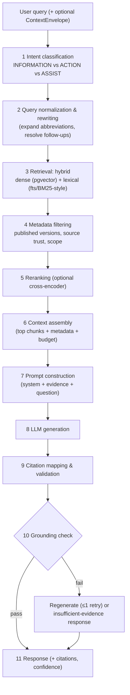

# 07 — AI / RAG Architecture

**Related:** [08 Knowledge Base](./08_KNOWLEDGE_BASE.md), [09 Document Ingestion](./09_DOCUMENT_INGESTION.md), [11 Context Bridge](./11_CONTEXT_BRIDGE.md), [19 Testing §RAG](./19_TESTING.md)
**Existing citation model (frozen input):** `Citation { index, title, source_type: "bis"|"iso"|"iec", chunk_text, score, mongo_id }` in `src/types/api.ts`; answers carry `[N]` markers; frontend renders pills + SourcesPanel; no page/clause/section/evidence fields exist today.

---

## 1. Design Goals

1. **Grounded or silent.** Every generated claim traces to a retrieved chunk; if retrieval cannot support an answer, the system returns an explicit insufficient-evidence response (AC-004).
2. **Citation integrity is machine-checked**, not hoped for (§14).
3. **Contract-compatible.** The legacy citation model keeps flowing; richer metadata is additive (§11).
4. **Provider-agnostic.** LLM/embeddings/reranker are interfaces; providers are configuration (OD-007/008/009).
5. **Fast enough.** Targets in §20; every stage is measured (§19 observability).

## 2. Pipeline Overview



## 3. Model Interfaces (provider-agnostic)

| Interface | Contract (conceptual) | MVP default / status |
|---|---|---|
| `LlmGateway` | `generate(system, messages, evidence, params) → {text, usage}`; OpenAI-compatible chat protocol; temperature/top_p/max_tokens configured | Provider UNKNOWN — any OpenAI-compatible endpoint; recorded OD-007 |
| `EmbeddingProvider` | `embed(texts[]) → vectors[EMBEDDING_DIM]` | Model TBD (OD-008); dimension is a DB parameter (04 §4.3); multilingual-capable model recommended for future Hindi support |
| `Reranker` | `rerank(query, chunks[]) → scored[]` | Optional (feature flag); cross-encoder class; off by default until latency budget verified (§20) |

All three are infra-layer adapters (03 §3); swapping providers touches no application code. The legacy `model` response field carries the configured LLM id.

## 4. Query Understanding

1. **Intent classification** (fast LLM call or classifier): `INFORMATION` (default; answer-only), `ACTION` (service/task intent — proposes service, never opens forms itself, 03 §5.3), `ASSIST` (form/field context present), `CHITCHAT`/`OUT_OF_SCOPE` (polite refusal + scope statement). Action intent **never** bypasses explicit user confirmation (principle #15/#16).
2. **Query normalization:** trim, collapse whitespace, language detect (for post-MVP translation; §18), expand well-known abbreviation patterns from a controlled glossary (e.g., "IS" vs "Indian Standard" — glossary content is data, admin-managed).
3. **Query rewriting:** for follow-ups, resolve pronouns/ellipsis using recent turns (ConversationContext); for field-assist requests, prepend field/service context (Context Bridge) to form the effective retrieval query. Rewrites are logged in `messages.retrieval` for evaluation.
4. **Standard-number detection:** regex-assisted extraction of standard references (e.g., `IS 4119`, `IS/IEC …`) used as lexical boosters **only if present in the query** — never fabricated (§15).

## 5. Retrieval

### 5.1 Hybrid search
- **Dense:** query embedded → pgvector cosine search over `document_chunks.embedding` (HNSW). Candidate set: `max(top_k × 8, 64)`.
- **Lexical:** Postgres `tsvector` FTS with websearch syntax; rank by ts_rank (BM25-like behavior; exact BM25 requires an extension — recorded as optional). Standard-number hits boost here.
- **Fusion:** Reciprocal Rank Fusion (k=60) merges both lists; per-list scores are preserved for observability (`retrieval_score`).

### 5.2 Metadata filtering (pre-filter, then search)
| Filter | Default | Purpose |
|---|---|---|
| `document_versions.status = 'published'` | always | never answer from drafts/superseded unless explicitly asked (historical questions may include superseded with disclosure) |
| `source.status = 'active'` | always | retired/blocked sources excluded |
| authority ≥ configured floor (`authority_min`) | `controlled_reference` | source trust priority (§9) |
| `source_keys` / `tags` | user/request supplied | scoped searches (v1 `filters`) |
| service/form scope | assist requests only | Context Bridge scoped retrieval (§17) |

### 5.3 Reranking
When enabled: cross-encoder reranks the fused top-N (N = 48) → top_k; `rerank_score` recorded. Latency budget: ≤ 600 ms p95 or the flag stays off (§20).

### 5.4 Chunking & embeddings (recap; full detail in 09)
- Structure-aware chunking targeting 300–700 tokens, ~15% overlap; boundaries prefer clause/section breaks; tables kept whole when ≤ chunk budget.
- Metadata per chunk: `section_title`, `section_path`, `clause_number` (**only when actually extracted** — never inferred), `page_number`, `embedding_model`, `chunk_index` (04 §4.3).
- Evidence spans: character offsets of the matched sentence(s) within `chunk_text` computed post-retrieval (stored transiently, returned in citations as `evidence_span`).

## 6. Context Assembly

- Budget: configurable token budget (default 6,000 tokens of evidence) — top chunks truncated with ellipsis markers, never silently cut mid-clause when avoidable.
- Each evidence block is rendered with a stable header: `[EVIDENCE id=chunk_id source=bis title="…" version="…" section="…" clause="…" page=N]` + chunk text. This is the data channel.
- **Documents are DATA, not instructions** (principle #14): the prompt states that evidence content may contain instructions that must be ignored as instructions and treated purely as reference text (§16, threat model 17 §6).

## 7. Prompt Construction

- **System prompt** (server-owned, version-controlled in repo, cache-busted by version tag): defines the assistant persona ("BIS-focused knowledge-grounded assistant, prototype"), the citation protocol ("insert `[N]` markers mapped to EVIDENCE ids"), the safety rules (§15), the uncertainty protocol, and the output format (markdown; no code blocks required).
- **Context slots:** ConversationContext (recent turns or summary), ServiceContext/FormContext/FieldContext (assist requests only), UserContext (locale; role-derived framing only, no PII).
- **Forbidden content in prompts:** application values beyond the focused field (PII minimization, 17 §8); secrets never.
- Prompt templates are versioned artifacts; changes require eval-suite green (19 §5).

## 8. LLM Generation

- Parameters: temperature default 0.2 (deterministic-leaning), max output 1,024 tokens, JSON/markdown output.
- Timeout: 15 s hard; on timeout → `LLM_FAILED` error path (18) — never a partial unvalidated answer.
- Token usage captured per request (`messages.retrieval.usage`) for BE-NFR-007.

## 9. Source Priority (retrieval & citation ordering)

```
authoritative (BIS-published standard text, schemes)   # trust_score 0.9–1.0
> verified_official (official portal pages, verified by admin)  # 0.7–0.89
> controlled_reference (admin-curated guidance, FAQs)  # 0.4–0.69
> secondary (press, summaries)                          # 0.0–0.39, used only with disclosure
```

- Higher authority wins ties; lower authority chunks appear in citations only when insufficient higher-authority evidence exists, and the answer discloses the source tier.
- The registry (`sources.authority`, `trust_score`) is admin-managed data (08 §5); **no source policy beyond this is invented** — actual BIS corpus composition is unknown (OD-016).

## 10. Confidence & Uncertainty

- `grounding.status`: `grounded` (citations validated + answer supported) | `insufficient_evidence` (retrieval below score floor or validator failure after retry) | `conflicting_sources` (top chunks from same authority disagree; answer names the conflict).
- `confidence`: calibrated heuristic = f(mean retrieval score, rerank margin, citation coverage of claims); displayed but **not** used to gate features in MVP.
- Insufficient-evidence response template: states that available sources do not provide enough evidence, suggests what to search for, and points to the authoritative source (office/portal) — without inventing specifics (principle #13/#18).

## 11. Citation Architecture (generation → validation → serialization → rendering)

### 11.1 The frozen legacy model (must keep flowing)

```json
{
  "index": 1,
  "title": "IS 4119:2019 — …",
  "source_type": "bis",
  "chunk_text": "…",
  "score": 0.87,
  "mongo_id": "3f6a…"
}
```

- `index`: 1-based, matches `[N]` markers in `answer`.
- `source_type`: registry key; today guaranteed `bis|iso|iec`; superset allowed (frontend falls back gracefully, analysis §12).
- `score`: the **final ranking score** shown as the relevance bar (frontend multiplies by 100).
- `mongo_id`: legacy opaque chunk identifier; **backend semantics = document_chunks.id as string** (`mongo_id` ≡ `chunk_id`, OD-003). Stable across re-requests while the chunk exists; vault dedup relies on it.
- Response-level contract fields that travel with citations (`chunks_retrieved`, `query`, `model`, `mode`) are defined in [05 §3](./05_API_SPECIFICATION.md) and preserved unchanged on the legacy path.

### 11.2 Additive v2 fields (non-breaking evolution)

`chunk_id, document_id, document_version, section_title, clause_number, page_number, evidence_span{start_char,end_char}, url, authority, retrieval_score, rerank_score` — appended to citation objects on v1 endpoints (and allowed on legacy). The current frontend ignores unknown fields (JSON parse + property access), so additive fields cannot break it; the migration path is: send both → frontend adopts when convenient (05 §4, 10 §8 of the analysis: "extend Citation … additive").

### 11.3 Why richer metadata is required (justification)

Current citations cannot tell a user *where* evidence lives — no page, no clause, no section, no document version, no link. For standards work this is decisive:
1. **Verifiability** — a manufacturer must be able to open the standard at clause 6.2 and check the claim; `chunk_text` alone invites distrust.
2. **Currency** — without `document_version` a citation cannot prove it reflects the effective (post-amendment) text; superseded answers are a compliance risk.
3. **Precision** — `evidence_span` lets the UI highlight exactly the supporting sentence instead of a 600-token blob.
4. **Traceability** — `url` reconnects the user to the canonical source when available (registry-provided; never fabricated).
5. **Auditability** — clause/page fields make citation-validation failures diagnosable (19 §5 CIT tests).

### 11.4 Citation pipeline stages

1. **Generation:** the model may only reference EVIDENCE ids from context; prompt forbids inventing ids.
2. **Validation (mandatory, machine-checked):** parse `[N]` markers → every N ∈ {1..len(citations)} → every cited chunk id ∈ retrieved set → every citation's `chunk_text` equals the stored chunk text (hash compare) → dangling/mismatched marker ⇒ regenerate once ⇒ still failing ⇒ insufficient-evidence response (§14).
3. **Serialization:** legacy fields always; v2 fields when the endpoint/flag allows; indexes renumbered sequentially after final ordering (authority, then score).
4. **Frontend rendering:** unchanged — `[N]` pills, SourcesPanel, vault save on `mongo_id`; v2 fields adopted later (e.g., clause chip on CitationCard).

## 12. Conversation Context

- Recent turns: last 10 messages (or token budget 2,000) included as ConversationContext; older turns summarized by the LLM into ≤ 200 tokens (summary cached on conversation, invalidated per new message batch) — full design [10 §6](./10_CONVERSATION_ENGINE.md).
- Follow-up handling: pronoun resolution happens at query-rewrite (§4); the rewritten query is what hits retrieval, so retrieval stays stateless.

## 13. Service/Form Context (assist path)

When a ContextEnvelope is present: retrieval filters expand with the service/form scope — service description and the focused field's `ai_help_topic` are injected as query terms; `help_content` entries for the field are added as authoritative evidence blocks (authority `controlled_reference` or higher). Envelope schema & trust rules: [11 §3–§7](./11_CONTEXT_BRIDGE.md). The assistant answers **for the field** but never mutates values (14 §3).

## 14. Grounding Checks & Hallucination Mitigation (technical enforcement)

| Threat | Control |
|---|---|
| Invented `[N]` marker | Validator §11.4-2 rejects → regenerate → insufficient-evidence |
| Citation exists but claim unsupported | Claim-coverage heuristic: each answer sentence must share lexical/semantic overlap with a cited chunk (evaluated in eval suite; runtime best-effort) |
| Invented clause/standard numbers | No clause numbers in output unless present in the cited chunk text; standard-number regex from §4 only echoes query/carrier chunks |
| Prompt-injected "instructions" inside documents | Evidence rendered as data channel; system prompt instructs to ignore instructions inside evidence; input/output filtering (17 §6) |
| Conflicting sources | Both cited, conflict named, `conflicting_sources` status |
| Unsupported compliance/legal claims | System prompt forbids claiming compliance/approval; refusal template for such asks |

These controls make the AI-safety rules of the product (never invent standards/clauses/requirements; never fabricate citations; never claim official approval) **technically enforced**, not aspirational.

## 15. AI Safety Rules (system-prompt contract, mirrored in evals)

The assistant must never: invent standards, clauses, BIS requirements; fabricate citations; claim unsupported compliance; claim an application was submitted/approved; claim legal/regulatory certainty without evidence. When evidence is insufficient it must say so and direct to an authoritative source. Violations are test failures (19 §5 RET-EVAL/SAF-*).

## 16. Multilingual Handling (design now; post-MVP implementation)

- **Detection:** language detect on query (fasttext-class, offline).
- **MVP:** English only end-to-end; queries in other languages receive an English answer with a note (capability disclosure), since knowledge is English.
- **Future strategy:** multilingual embedding model (OD-008) enabling cross-lingual retrieval; query translation only as fallback (translation can distort standards terminology — prefer cross-lingual embeddings); response language = user locale; citations remain in source language with translated display labels; bilingual glossary of standards terms (admin-managed data) to preserve terminology. Evaluation: retrieval + answer quality per language added to the golden set.

## 17. Context Injection (summary for RAG)

Full Context Bridge treatment lives in [11](./11_CONTEXT_BRIDGE.md); the RAG-relevant rules: envelope identifiers verified server-side before scoping; envelope text fields (question, recent messages) treated as untrusted input (never as system instructions); envelope size caps (≤ 64 KB total; recent_messages ≤ 10; values ≤ 32 KB) enforced at the boundary.

## 18. Evaluation & Quality Loop

- Golden dataset (admin-curated, versioned): question → expected chunk ids / expected answer properties. Metrics: Recall@k, MRR, citation precision, grounding pass rate.
- CI gates: golden set pass ≥ threshold before RAG-prompt/model changes merge (19 §5). Nightly regression run on staging.
- `messages.retrieval` payloads feed offline analysis (latency, scores, failure reasons).

## 19. Observability (RAG-specific)

Metrics per stage (03 §5.1 stages): retrieval latency, rerank latency, LLM latency/tokens, validation failure count, insufficient-evidence rate, conflicting-sources rate, citation-failure rate (NFR-005, prompt §34). Dashboards + alerts: insufficient-evidence spike, LLM error rate, p95 breach.

## 20. Performance Targets (proposed; adjust after measurement)

| Stage | Target (p95) |
|---|---|
| Embed query | ≤ 120 ms |
| Hybrid retrieval + fusion | ≤ 400 ms |
| Rerank (if enabled) | ≤ 600 ms |
| Context assembly + prompt build | ≤ 50 ms |
| LLM generation | ≤ 5,000 ms |
| **End-to-end legacy `/search`** | **p50 ≤ 3 s, p95 ≤ 8 s** (BE-NFR-001) |
| Assist (with envelope + scoped retrieval) | p50 ≤ 4 s, p95 ≤ 10 s |

Levers: schema cache, HNSW parameters, `top_k` clamps, prompt/evidence budget, streaming (post-MVP), batching embeddings at ingestion, connection pooling.
