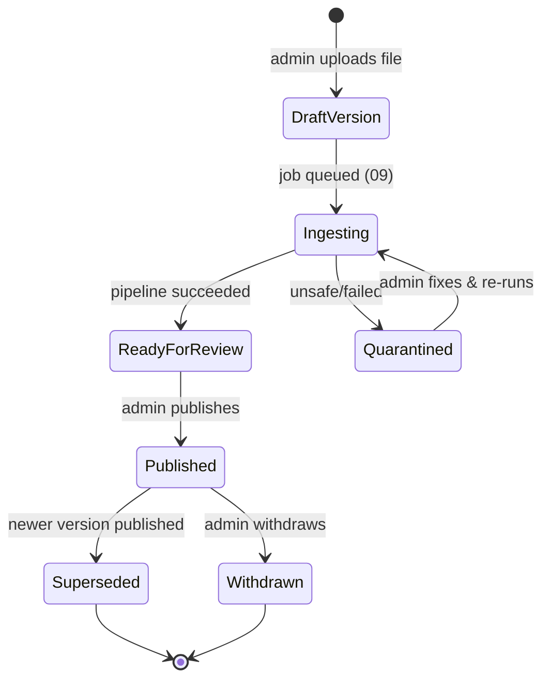

# 08 — Knowledge Base Design

**Related:** [04 Database §4.3](./04_DATABASE_DESIGN.md), [07 AI/RAG](./07_AI_RAG_ARCHITECTURE.md), [09 Document Ingestion](./09_DOCUMENT_INGESTION.md)
**Standing constraint:** **no specific BIS dataset is claimed to exist.** What is described here is the *model and process*; corpus acquisition is an open decision (OD-016) and all example content in this set is illustrative.

---

## 1. Purpose & Scope

The knowledge layer is what makes answers groundable: a versioned, trust-rated, metadata-rich corpus of BIS-relevant documents and controlled metadata, ingested through a controlled pipeline (09) and retrieved only in `PUBLISHED` state (07 §5.2).

## 2. Concepts & Entities

| Concept | Definition | Table |
|---|---|---|
| **Source** | Registry entry for an origin of knowledge (e.g., BIS, ISO, IEC) with a trust level and badge metadata | `sources` |
| **Document** | A logical work: a standard, an amendment, a corrigendum, a guidance doc, service information, an FAQ set | `documents` |
| **Document Version** | An immutable, published-or-draft edition of a document with effective/publication dates and the source file | `document_versions` |
| **Chunk** | A retrieval unit: text + structure metadata + embedding | `document_chunks` |
| **Section / Clause** | Structure metadata **observed in the document** during ingestion (never guessed): section title/path, clause number, page | columns on chunks |

### 2.1 Document kinds (`doc_kind`)
`standard` (the core IS texts), `amendment`, `corrigenda`, `guidance` (scheme/handbooks/how-to), `service_info` (per-service descriptive content), `faq`. Kind drives retrieval defaults (e.g., amendments joined to their base standard at answer time by standard-code + effective dates) and admin review emphasis.

## 3. Versioning, Supersession & Currency

- Every ingestion creates a **new draft document_version**; publish makes it retrievable; publishing a version automatically marks any prior current version `superseded` (pointer `supersedes_version_id` retained).
- `effective_date` (when it governs) and `publication_date` (when released) are metadata columns; retrieval defaults to the **current published version** per document; explicit historical questions may retrieve superseded versions with disclosure in the answer ("as per the 2019 edition, superseded by …").
- Amendments/corrigenda are separate documents linked by `standard_code`; the retrieval layer boosts base-standard chunks and their active amendments together (07 §4.4 standard-number detection).
- Archival: withdrawn versions stay queryable for audit/admin, never for default retrieval.

## 4. Source Trust & Authority (07 §9 recap)

| Authority level | Meaning (illustrative, admin-assigned) | Example origin |
|---|---|---|
| `authoritative` | BIS-published standard/scheme text | BIS-published documents (when acquired — OD-016) |
| `verified_official` | Official web content verified by an admin | bis.gov.in pages (verified copies) |
| `controlled_reference` | Admin-curated explanations, FAQs, internal guidance | project-authored content |
| `secondary` | Everything else | press summaries |

`trust_score` (0–1) refines ordering within a level. The frontend badge registry (`bis|iso|iec` + graceful fallback) maps to `sources.key`/`badge_label` — new source keys flow to the UI without code changes (analysis §12: fallback tolerant of future keys).

## 5. Controlled Metadata (admin-managed)

| Registry | Contents | Consumers |
|---|---|---|
| Source registry | key, name, authority, trust_score, badge_label, url_base, status | retrieval filters; citation fields; GET /api/v1/sources |
| Terminology glossary | abbreviation → expansion, bilingual terms (future) | query normalization (07 §4), multilingual (07 §16) |
| Topic tags | tag → description; attachable to documents | scoped retrieval filters (05 §4) |
| Service knowledge bindings | service_key → document_version refs | assist-scoped retrieval (07 §13) |

## 6. Content Coverage Model (what the corpus should contain)

Coverage targets by user need (01 §D): standards discovery (`standard` docs), standards explanation (`standard` + `guidance`), certification guidance (`guidance` + `service_info` for product certification), hallmarking information (`guidance`/`service_info`), testing/laboratory information, consumer services, FAQs. Acquisition per domain is **an open decision and manual admin work** (OD-016) — no automatic BIS access is assumed (09 §1).

## 7. Knowledge Lifecycle

Invariants:
1. Unpublished content is invisible to retrieval (BE-FR-052).
2. Published versions are immutable; corrections go through a new version (08 §3).
3. Every publish/unpublish/withdraw is audited (`knowledge.source_published`, 16 §4).
4. Deletion is not an operation on published knowledge (supersede/withdraw instead).

## 8. Knowledge Maintenance & Updates

- **Update cadence:** admin-driven; a quarterly review job flags documents with `publication_date` older than the configured staleness window for admin review (report only — no auto-action).
- **Change detection:** when a new version of a known `standard_code` is uploaded, the pipeline links it via `supersedes_version_id` and flags the old version; admin publishes to switch.
- **Retraction:** admin withdraws a version if content proves wrong; retrieval stops including it immediately (cache invalidation on publish/withdraw).

## 9. Retrieval Visibility Rules (summary)

| Content state | Searchable? |
|---|---|
| draft version | No |
| ingesting/failed/quarantined | No |
| published (current) | Yes |
| published (superseded) | Only for explicit historical queries, with disclosure |
| withdrawn | No (admin-only view) |
| source retired/blocked | No (even if chunks exist) |

## 10. Acceptance Criteria (knowledge layer)

| ID | Criterion |
|---|---|
| AC-KB-1 | Only `PUBLISHED` chunks appear in retrieval results (test RET-FILT-001). |
| AC-KB-2 | Publishing version N+1 auto-supersedes N; historical queries disclose supersession (test KB-VER-002). |
| AC-KB-3 | A `secondary`-authority chunk never outranks an `authoritative` chunk at equal relevance (test RET-ORDER-003). |
| AC-KB-4 | Badge registry keys added by admin surface in `GET /api/v1/sources` and render with fallback badges (test API-SRC-001). |
| AC-KB-5 | Withdrawn content disappears from retrieval within one cache TTL (test KB-LIFE-004). |
