# 09 — Document Ingestion Design

**Related:** [08 Knowledge Base](./08_KNOWLEDGE_BASE.md), [04 Database §4.3/§4.7](./04_DATABASE_DESIGN.md), [03 §5.5](./03_BACKEND_ARCHITECTURE.md)
**Standing constraint:** ingestion is a **controlled, manual-entry process**. No automatic access to BIS documents or systems is assumed; no crawler hits bis.gov.in in MVP (RULE 3, OD-016).

---

## 1. Pipeline (canonical stages)

```mermaid
flowchart LR
    S["Source<br/>(admin-selected)"] --> F["Fetch / Upload"]
    F --> V["File validation"]
    V --> T["Text extraction"]
    T --> O["OCR if needed"]
    O --> SD["Structure detection"]
    SD --> M["Metadata extraction"]
    M --> C["Chunking"]
    C --> E["Embedding"]
    E --> I["Indexing"]
    I --> Q["Validation checks"]
    Q --> P["Publish (admin gate)"]
```

| Stage | What happens | Failure mode |
|---|---|---|
| Fetch/Upload | Admin uploads via `POST /api/v1/admin/knowledge/documents` (multipart) → S3; DB row `document_versions(status=draft)` + `ingestion_jobs(status=pending)` | upload validation errors are synchronous 422 |
| File validation | MIME sniff (magic bytes), size ≤ 100 MB, page-count probe, AV scan hook | `failed` (recoverable=false) → quarantine |
| Text extraction | PDF text layer extraction (library-agnostic adapter); structured text (txt/md) passthrough; images skip to OCR | empty/short text → OCR path |
| OCR | Adapter interface (`OcrEngine`); engine TBD (OD-020); scanned PDFs/images → text + per-page mapping | engine unavailable → `failed` with recoverable=true |
| Structure detection | Heading/numbering detection (e.g., clause numbering patterns, TOC hints) → `section_title`, `section_path`, `clause_number`, `page_number` metadata; **only detected values stored — never inferred/guessed** | poor structure → chunks without clause metadata (valid state) |
| Metadata extraction | declared standard code, edition/year, title page fields → admin-confirmable suggestions (admin edits metadata before publish; system never auto-publishes) | mismatch with admin input → flag on job |
| Chunking | structure-aware: prefer clause/section boundaries; 300–700 tokens; ~15% overlap; tables kept whole when within budget | degenerate docs → size-based fallback chunking |
| Embedding | batch embed via `EmbeddingProvider`; `embedding_model` recorded per chunk; `EMBEDDING_DIM` must match model | model mismatch → job fails before indexing (no partial index) |
| Indexing | insert chunks (+ HNSW-maintained vectors, GIN tsvector) inside one transaction per document version | unique violations → duplicate detection (§7) |
| Validation checks | counts sane (chunks ≥ 1, avg tokens in range), spot-check retrieval smoke query, metadata completeness report | warnings visible on job; admin decides |
| Publish | admin explicitly publishes (`POST …/publish`) → version `published`, prior current auto-superseded, caches invalidated (08 §7) | — |

## 2. Job Model & States

`ingestion_jobs`: `pending → running (stage_detail ∈ {fetch, extract, structure, metadata, chunk, embed, index, validate}) → published | failed | quarantined`.

- **Retries:** recoverable failures auto-retry with exponential backoff (30 s → 2 m → 8 m), budget `attempts ≤ 3`; beyond budget → `failed` (admin may retry via API — BE-FR-051).
- **Idempotency:** `idempotency_key = hash(file_hash + document_version_id)`; re-enqueue of the same file/version never duplicates chunks (chunks wiped per version before re-run inside the transaction).
- **Partial processing:** chunk inserts are transactional per document version — a crash leaves either old state or complete state, never half a version visible (drafts aren't retrievable anyway; double protection).
- **Quarantine:** files failing validation (malware signature, unreadable, oversized) are quarantined (S3 quarantine prefix + job state `quarantined`), listed to admin, never indexed; audit event written.
- **Failed jobs:** visible in admin list with `error {stage, reason, recoverable}`; retry API per BE-FR-054.

## 3. Duplicate & Version Detection

| Check | Key | Resolution |
|---|---|---|
| Exact duplicate file | `file_hash` (SHA-256) | `409 DUPLICATE_DOCUMENT` at upload with pointer to existing version |
| Same standard re-upload | `(source_id, standard_code)` + declared `version_label` | linked as new version (`supersedes_version_id` suggestion) — admin confirms |
| Content near-duplicate | minhash/simhash of extracted text (best-effort signal, not blocker) | warning on job for admin review |

## 4. Format Support (MVP → future)

| Format | MVP | Mechanism |
|---|---|---|
| Digital PDF | ✅ | text-layer extraction |
| Scanned PDF / images | ✅ (engine permitting) | OCR adapter; clean failure if engine absent |
| Structured text (txt/md) | ✅ | passthrough + heading heuristics |
| DOCX / HTML | future | adapter extension (no architecture change) |

## 5. Security Controls in Ingestion (details in 17 §6/§7)

- Upload auth: admin-only; AV scan hook; filename sanitization; S3 key namespacing (`knowledge/{source_key}/{document_id}/{version}/source.pdf`).
- Extracted text is **untrusted content** (prompt-injection source) — handled as DATA downstream (07 §6/§16; 17 §6).
- Resource limits: job memory/time caps; oversized extraction → fail with recoverable=false (protect the worker pool).

## 6. Reprocessing & Re-embedding

- **Reprocess** (same file, fixed pipeline/config): admin re-runs job; chunks for the version are replaced atomically.
- **Re-embed all** (embedding model change): documented migration in 04 §8 — dual-column write, background backfill job, cut-over, old column drop. Retrieval continues on the old column until cut-over (no downtime, no mixed-model index).

## 7. Audit Trail

Every stage transition of interest emits audit events: `knowledge.document_uploaded`, `knowledge.ingestion_completed`, `knowledge.ingestion_failed`, `knowledge.quarantined`, `knowledge.source_published`. Admin UI/API (05 §5.10) exposes job history; `created_by_user_id` records the uploader.

## 8. Acceptance Criteria (ingestion)

| ID | Criterion |
|---|---|
| AC-ING-1 | Uploaded digital PDF becomes retrievable only after admin publish (ING-001..004). |
| AC-ING-2 | Duplicate file upload returns 409 with existing pointer; no chunks duplicated (ING-DUP-001). |
| AC-ING-3 | Crash between chunking and indexing leaves no retrievable trace and job retryable (ING-IDEM-002). |
| AC-ING-4 | Quarantined file never appears in retrieval or admin publish options (ING-SEC-001). |
| AC-ING-5 | Re-embed migration completes with zero retrieval downtime and no mixed-model results (ING-EMB-001). |
