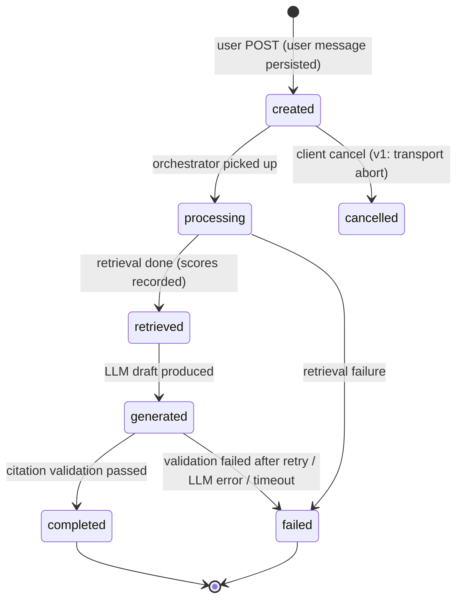

# 10 — Conversation Engine

**Current state (analysis §6–§7):** chat is a component-local `ChatMessage[]` (`{id, query, response?, status: "loading"|"success"|"empty"|"error", timestamp}`) in `IndexView`; history is a separate localStorage model (`HistoryEntry`, cap 50, `bis-sih_history`) restored via `?historyId=`/`?query=`/`?new=1`; one non-streamed POST per question; retry/regenerate re-submit the same query string; no roles array, no thread object, no server persistence.
**Related:** [05 §5.4](./05_API_SPECIFICATION.md), [04 §4.2](./04_DATABASE_DESIGN.md), [07 AI/RAG](./07_AI_RAG_ARCHITECTURE.md)

---

## 1. Concepts

| Concept | Definition |
|---|---|
| **Conversation** | An ordered, persisted thread owned by one user (`conversations`) — the server-side replacement for the localStorage history list |
| **Message** | A turn in a conversation (`messages`); roles: `user`, `assistant`, `system` |
| **User message** | The raw question text (what the frontend sends today as `query`) |
| **Assistant message** | The generated answer (`content` markdown with `[N]` markers) + `citations` JSONB + `grounding` metadata |
| **System context** | Server-owned prompt scaffolding (persona, safety rules); **not** stored as user-visible messages; not client-supplied (17 §6) |
| **Source citations** | Citation array on assistant messages; legacy fields always present (07 §11) |
| **Retrieval context** | Debug/eval payload (`messages.retrieval`): rewrite, filters, scores, latency, token usage — internal only |

## 2. Message Lifecycle

Implementation note: statuses are recorded in one row per message; intermediate transitions are written opportunistically (MVP keeps the row's final state authoritative — a crashed request ends `failed`, never silently `completed`).

## 3. Server Persistence Design

- `POST /api/v1/conversations/{id}/messages` persists the **user message immediately** (durability before compute), then the assistant message row is created and updated to its terminal state (`completed`/`failed`) before the HTTP response returns (single request/response, matching the current frontend's non-streaming renderer).
- Failure contract mirrors today's UX: any failure returns non-2xx (v1 envelope) **and** leaves the assistant message row in `failed` with `error {code, message}` — the history stays truthful.
- Empty results are **not** failures: assistant message `completed` with empty content + zero citations, HTTP 201; the frontend's "empty" state derives from `grounding.status` / citations length.
- Conversation metadata (`last_message_at`, `message_count`, title) updated in the same transaction as the terminal assistant state.

## 4. Conversation Memory

| Mechanism | Rule |
|---|---|
| Recent turns | Last 10 messages (≤ 2,000 tokens) passed verbatim as ConversationContext |
| Summarization | When older context is needed: rolling summary ≤ 200 tokens generated by LLM, cached on the conversation (invalidated on new messages); summary is **AI-derived data** (trust class per prompt §30), never authoritative |
| Token limits | Evidence budget 6,000 tokens (07 §6) + memory 2,000 + output 1,024 ≤ configured context window of the LLM; if the window is exceeded, oldest turns drop first, then summary shrinks |
| Context window | Configured per deployment (`LLM_CONTEXT_WINDOW`); assembly asserts the invariant above at runtime |

## 5. History, Regeneration, Retry

- **History:** v1 list endpoints paginate conversations/messages (05 §5.4). The frontend keeps its `?historyId=` restore UX during migration by mapping to `GET /conversations/{id}/messages`.
- **Regeneration:** `POST …/messages/{message_id}/regenerate` creates a **new** assistant message (prior retained for audit); frontend's existing "regenerate" button maps here in Stage 5.
- **Retry:** the frontend's retry-on-error re-submits the query — with server persistence this becomes: failed assistant row remains; the new submission adds a fresh pair (dedup is not attempted; the log is honest).
- **Title generation:** server-side `generateTitle(query)` equivalent (first 48 chars / heuristic), replacing the client-side helper over time (both tolerable during migration).

## 6. Cancellation

- MVP: client-side abort (frontend currently has no `AbortController` — a small frontend fix listed in NFR-012/tech-debt) cancels the *rendering wait*; server may still complete the row (documented behavior).
- Server-side cooperative cancellation (`cancel` endpoint + worker flag) is **future** — designed as `POST /api/v1/conversations/{id}/messages/{message_id}/cancel` returning `202`, transitions `created/processing → cancelled`; not in the MVP endpoint catalog (OD-019 tracks).

## 7. Streaming — Decision: LATER

**Decision: streaming is post-MVP (Stage 12+ / OD-019).** Reasons:
1. The current UI has **no streaming renderer** (analysis §6: loading skeleton per message; mock SSE `GET /api/chat` is unconsumed) — server streaming alone delivers zero user-visible value.
2. The frozen `/search` contract is single-shot JSON; streaming would be a new endpoint (`…/messages:stream`, SSE), not a change.
3. Latency targets (p50 ≤ 3 s) are acceptable without token streaming for MVP.

When enabled: SSE with `event: message {token, done:false}` frames (matching the mock's shape), final `event: done {message_id, citations, grounding}`; citations validated **before** `done` (no unvalidated text ever finalized). Requires the new frontend renderer; the mock route is then replaced.

## 8. Migration from localStorage (server-side persistence adoption)

| Phase | Frontend | Backend | Behavior |
|---|---|---|---|
| 0 (today) | localStorage only | — | current UX unchanged |
| 1 | login lands | conversations live | local history kept as-is; new asks ALSO persist server-side when session exists (dual-write) |
| 2 | migration tool | `POST /api/v1/conversations/import` (BE-FR-014) | one-time import of `bis-sih_history` entries (idempotent via client-generated ids); local store becomes cache |
| 3 | server-first | — | sidebar lists server conversations; `?historyId=` resolves server-side; localStorage pruned to session prefs (theme, display name) |
| 4 | cleanup | — | legacy keys deprecated |

Vault/collections follow the same pattern later (FR-022, future scope). All steps are additive; no step breaks the current frontend (RULE 5).

## 9. Errors & Edge Cases

| Case | Behavior |
|---|---|
| Retrieval failure | assistant `failed`, HTTP 502 `RETRIEVAL_FAILED`; retry UI unchanged |
| LLM timeout | `LLM_FAILED` 504; never partial content |
| Citation validation failure after retry | `grounding.status = insufficient_evidence`, still `completed` (truthful "I couldn't ground this") |
| Rate limited | 429 `RATE_LIMITED` + `Retry-After`; frontend maps to error state with message |
| Duplicate rapid submits | allowed (each its own pair); client may debounce (frontend concern) |
| Conversation deleted mid-request | 404 `NOT_FOUND`; no orphan writes (FK + ownership checks) |

## 10. Acceptance Criteria

| ID | Criterion |
|---|---|
| AC-CONV-1 | Ask via v1 → user + assistant rows persisted with terminal states; reload shows history (CONV-001). |
| AC-CONV-2 | Failed LLM call leaves truthful `failed` row + non-2xx response; retry creates new pair (CONV-ERR-002). |
| AC-CONV-3 | Memory: 15-turn conversation keeps answers coherent for pronoun follow-ups within token budget (CONV-MEM-003). |
| AC-CONV-4 | Import endpoint is idempotent: re-running with the same localStorage export duplicates nothing (CONV-MIG-004). |
| AC-CONV-5 | Regenerate retains prior message and appends new one (CONV-REG-005). |
