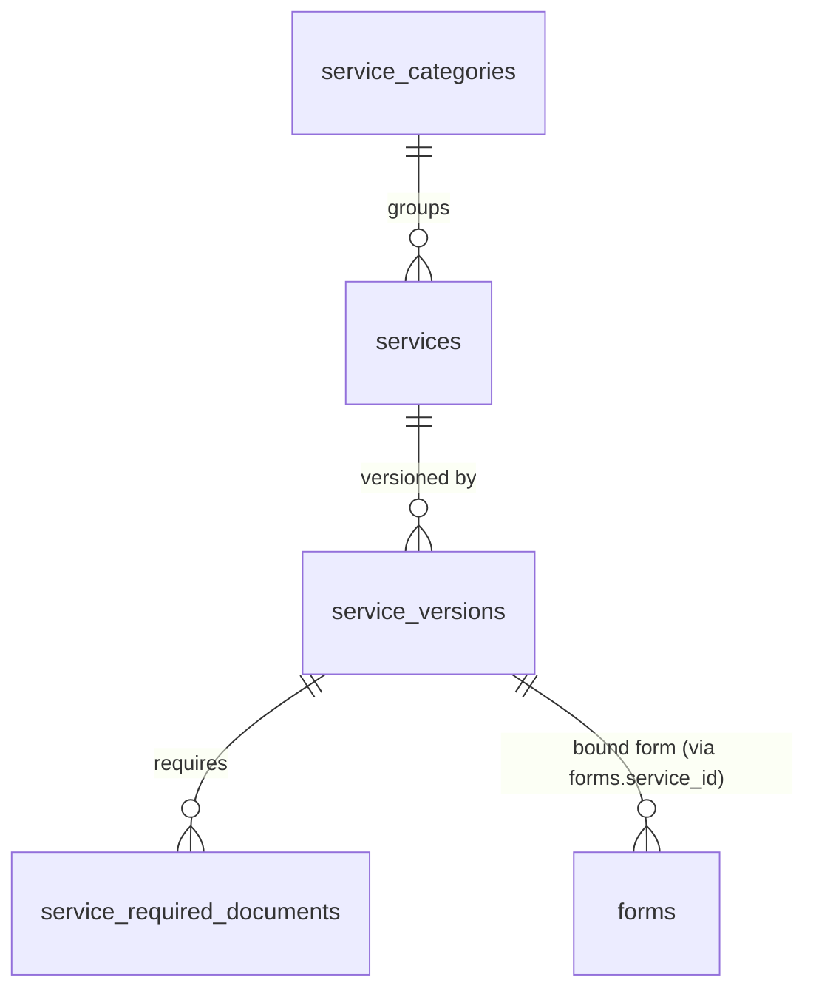
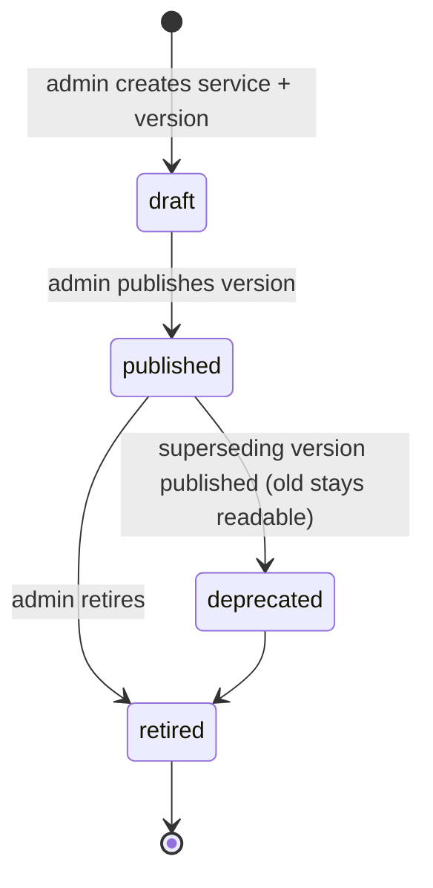

# 12 — BIS Service Catalogue

**Related:** [04 §4.4](./04_DATABASE_DESIGN.md), [05 §5.6](./05_API_SPECIFICATION.md), [13 Form Engine](./13_BIS_FORM_ENGINE.md), [15 Workflow](./15_VALIDATION_AND_WORKFLOW.md)
**Standing constraints:** the catalogue is a **generic, data-driven model** — not a hard-coded list of BIS services. Categories below are *conceptual*; no official BIS taxonomy is claimed or verified (RULE 3/4). No official BIS APIs are assumed; external interaction is modelled behind an adapter (§9).

---

## 1. Goals

1. Users discover what BIS services exist and what each requires **before** starting anything.
2. Admins add or update services **without backend code changes** (content + form-schema publishing only).
3. Each service carries its own evidence trail (`source_refs`) tying descriptions to ingested documents (08), so catalogue claims are grounded too.

## 2. Model Overview



Entities and columns are specified in [04 §4.4](./04_DATABASE_DESIGN.md); this document defines semantics.

| Concept | Semantics |
|---|---|
| **Service** | A BIS-related offering the assistant can explain and, when it has a form, support applying for (`services` + public `service_key`) |
| **Service Category** | Grouping for browsing (`product-certification`, `hallmarking`, `testing-laboratory`, `standards-information`, `consumer-services` — **conceptual, unverified**) |
| **Service Version** | Immutable published snapshot of description/eligibility/fees/workflow/links; applications pin a version |
| **Eligibility** | Human-readable criteria list (content, **not** enforced logic — 12 §5) |
| **Required Documents** | Typed checklist consumed by form file-upload (future) and copilot "required documents" answers |
| **Application Form** | Optional binding to a `forms`/`form_versions` row (13) |
| **Instructions** | Per-service guidance content (help_content / service_info documents) |
| **Fees** | Modelled display data with `note`; **never presented as authoritative** unless a verified source ref exists |
| **Workflow** | Reference to a workflow template (15 §3) governing application states |
| **External Link / Integration** | Official page URL (if any) + `integration_status` (manual_only in MVP) |
| **Status** | draft / published / deprecated / retired |

## 3. Service Lifecycle



Rules: only `published` services appear in `GET /api/v1/services` and can start applications; drafts invisible (no existence disclosure); deprecation keeps existing applications readable while blocking new ones; all transitions audited (`service.updated`).

## 4. Service Definition Template (admin-facing shape)

```json
{
  "service_key": "product-certification",
  "name": "Product Certification (illustrative placeholder)",
  "category": "product-certification",
  "version": 3,
  "summary": "Scheme under which a product may be licensed to use the ISI mark. Illustrative content pending verification.",
  "eligibility": [
    {"criterion": "manufacturing_site_in_india", "description": "…"},
    {"criterion": "testing_facility_access", "description": "…"}
  ],
  "required_documents": [
    {"key": "manufacturing-license", "name": "Factory license", "mandatory": true, "accepted_formats": ["pdf"]},
    {"key": "test-report", "name": "Third-party test report", "mandatory": true, "accepted_formats": ["pdf"]}
  ],
  "fees": [{"item": "application_fee", "amount": null, "currency": "INR", "note": "To be confirmed from official source"}],
  "workflow_ref": "standard-application-v1",
  "external_link": null,
  "integration_status": "manual_only",
  "source_refs": [{"document_version_id": "…", "locator": "Scheme pages 3–5"}],
  "allowed_roles": ["manufacturer", "laboratory", "consumer", "researcher", "student"],
  "status": "published"
}
```

`fees.amount: null` above is deliberate: inventing fee figures would violate the no-fabrication rules; content teams fill values only from verified sources with `source_refs`.

## 5. Eligibility & Documents — Semantics

- Eligibility entries are **display + copilot context**, not gates: the system explains criteria (with citations) but does not compute eligibility; the user self-assesses; server validation never rejects an application "for ineligibility" (15 §5 business-rule tier covers only schema-own rules).
- Required documents drive: form file-upload requirements (future), validation `document` tier (15 §5), and the copilot's "which document is required?" answers (14 §2).

## 6. Adding a Service Without Code Changes (the design test)

Full path, zero backend deploys: ① admin uploads explanatory documents → ingestion → publish (09); ② admin creates service + version via admin APIs (05 §5.10) incl. eligibility/documents/fees/source_refs; ③ admin creates form + version and publishes (13 §7); ④ service version binds `form_key`; ⑤ publish service → appears in catalogue + Action Mode. Only content and schema publishing — the backend never learns a new service's name, fields, or rules in code.

## 7. Seed Content (illustrative placeholders — flagged in data)

Seed migration ships exactly **one** illustrative service + form (13 §8): `product-certification` with a generic "Product Certification Application" schema, every label row marked "illustrative placeholder — requires verification". Optional seeds: `hallmarking-registration`, `laboratory-recognition` (same flag). **Nothing in seed data claims to be an official BIS form or requirement.** Actual first services are an open decision (OD-013/014).

## 8. Roles & Catalogue Access

- Read: public (05 §5.6). Create application: per `allowed_roles` on the service version + `application:create` permission (06 §6). This resolves how a `consumer` uses consumer-category services while `manufacturer` uses certification services — without per-service code.

## 9. External Integration Points (adapter only)

| Interaction | MVP | Future |
|---|---|---|
| "Apply officially" | service shows `external_link` (if any) + instructions; application terminates internally at SUBMITTED (manual hand-off documented) | `ExternalBisAdapter.submit(application)` — TBD / requires verification (OD-015) |
| Status polling of submitted application | not available | adapter method + status mapping; `EXTERNAL_PROCESSING`/`COMPLETED` transitions become automatable |
| Fee/status lookups | static modelled content only | same adapter surface |

The adapter interface is defined but ships as **NoOp/manual**; no core code depends on unverified APIs (architecture principle #20).

## 10. Acceptance Criteria

| ID | Criterion |
|---|---|
| AC-SRV-1 | A published service appears in list/detail APIs without deploy; draft services do not (SRV-*). |
| AC-SRV-2 | New service version deprecates the old without breaking pinned applications (SRV-VER-002). |
| AC-SRV-3 | `service.detail` claims with `source_refs` render citation-backed (admin surface; CB scope) (SRV-SRC-003). |
| AC-SRV-4 | Retired service cannot start new applications; existing ones remain readable (SRV-LIFE-004). |
| AC-SRV-5 | Adding the seed service requires no code change — migration/content only (SRV-SEED-005). |
