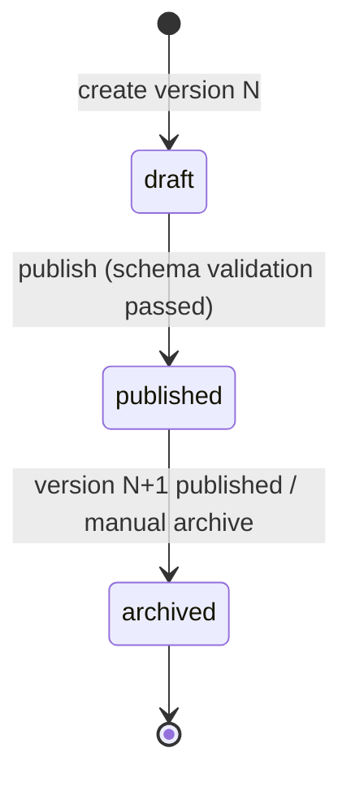

# 13 — BIS Form Engine (schema-driven)

> **Critical design rule:** BIS forms are **data (versioned schemas), not hardcoded React components.** One renderer consumes any published schema; new/changed forms require content publishing, not code.
**Frontend foundation (existing):** 47 shadcn/Radix primitives + the unused `ui/form.tsx` scaffold (react-hook-form + zod, installed) — the first real consumers of this stack (analysis §5/§23.4).
**Related:** [04 §4.5](./04_DATABASE_DESIGN.md), [05 §5.6/§5.7](./05_API_SPECIFICATION.md), [15 Validation](./15_VALIDATION_AND_WORKFLOW.md), [14 Copilot](./14_BIS_FORM_COPILOT.md)

---

## 1. Concepts

| Concept | Definition | Storage |
|---|---|---|
| **Form** | Logical form identity (`forms`, public `form_key`) | row |
| **FormVersion** | Immutable schema snapshot; the unit an application pins (`form_versions`) | row + children |
| **Section** | Ordered page/step grouping (`form_sections`, `key`) | row |
| **Field** | A typed input (`form_fields`, `field_key`; canonical `field_id = {section_key}.{field_key}`) | row |
| **FieldOption** | Closed choice values for select/multiselect/radio (`field_options`) | rows |
| **ConditionalRule** | JSON rule driving visibility/requirement (§6) | `visibility_condition` / `required_condition` / `form_versions.conditional_rules` |
| **ValidationRule** | Field-level constraints + cross-field rules (15 §5) | `form_fields.validation` / `form_versions.validation_rules` |
| **HelpContent** | Per-locator guidance: `help_text` (inline), `description`, and `form_versions.help_content` (overview + FAQs per section/field) — the copilot's first-choice evidence (14 §5) | JSON |

## 2. Field Types (supported set)

`text`, `textarea`, `number`, `decimal`, `date`, `select`, `multiselect`, `radio`, `checkbox`, `file`, `address`, `repeatable_group`.

| Type | Value shape (application_values.value JSONB) | Renderer mapping (existing primitives) |
|---|---|---|
| text / textarea | string | Input / Textarea |
| number / decimal | number (decimal adds precision) | Input type=number + precision validation |
| date | ISO date string | Calendar/Popover (existing `calendar` primitive) |
| select / radio | string (option value) | Select / RadioGroup |
| multiselect | string[] | Multiple badges or Checkbox group |
| checkbox | boolean | Checkbox |
| file | `{file_key, name, size, mime, hash}` (future: upload API) | post-MVP (11 §"file upload not found" — designed, not built in MVP) |
| address | `{line1, line2?, city, state, pincode, country}` | composite component |
| repeatable_group | array of child value maps (`max_occurrences` cap) | nested field list |

Unknown/unsupported `field_type` values **fail publish-time validation** (SCHEMA_INVALID) — the schema can never render a field the engine doesn't know.

## 3. Field Metadata (complete set per field)

`field_id`, `field_key`, `field_type`, `label`, `placeholder`, `description` (rendered under label), `help_text` (inline), `required` (+ `required_condition`), `visibility_condition`, `validation` (§5), `options` (closed sets), `sort_order`, `max_occurrences`, and **AI assistance metadata**: `ai_help_topic` — a stable topic key linking the field to scoped knowledge (help documents, scheme text) for the copilot (14 §5). Fields without `ai_help_topic` fall back to label/help_text-only answering.

## 4. Field ID Convention (canonical, cross-doc)

`field_id := "{section_key}.{field_key}"` — used in: `application_values.field_id`, PATCH values maps, validation error `field_id`s, Context Bridge `field_context.field_id`, audit redaction keys, copilot `error_explain` requests. Kebab/snake keys only; no spaces; no camelCase variants anywhere (RULE 7). Repeatable groups address items as `{section_key}.{field_key}[{index}]` for display, while stored values keep the array shape.

## 5. Validation Rules (schema-level)

| Rule keys (field `validation` JSON) | Applies to |
|---|---|
| `min_length`, `max_length` | text/textarea |
| `pattern` (regex, anchored) | text |
| `min`, `max`, `integer_only` | number |
| `precision`, `scale` | decimal |
| `min_date`, `max_date`, `disallow_future` | date |
| `min_items`, `max_items` | multiselect / repeatable_group |
| `allowed_states` (list) | address.state (registry-driven) |
| `message_overrides` ({rule: message}) | all |

Cross-field rules live on `form_versions.validation_rules` (15 §5.3): `{"rule_id": "…", "when": {…}, "assert": {…}, "message": "…", "severity": "error|warning"}`. The same JSON is delivered to the frontend in the schema payload for **client-side zod derivation** (advisory) while the server (ValidationService) remains **authoritative** (15 §2).

## 6. Conditional Logic (visibility & requirement)

Rule DSL (kept intentionally small and machine-checkable):

```json
{
  "when": { "field_id": "applicant.organization_type", "operator": "equals", "value": "manufacturer" },
  "then": { "visibility": "visible", "required": true }
}
```

- Operators: `equals`, `not_equals`, `in`, `not_in`, `is_empty`, `is_not_empty`, `gt`, `lt` (typed comparisons per field type).
- Attached at `form_fields.visibility_condition` / `required_condition` (single rule) or composed as an ordered list on `form_versions.conditional_rules` (first match wins).
- Example (**generic illustration, not a real BIS rule**): if `applicant.organization_type = manufacturer` then `applicant.manufacturer_license` becomes visible and required.
- Evaluation: client re-evaluates on every change for UX; **server re-evaluates authoritatively** at save/validate — hidden fields with values are ignored, conditionally-required fields missing values are errors (15 §6).
- Publish-time checks: rule targets must exist; no cyclic dependencies (topological check); operators valid for field types.

## 7. Versioning & Immutability



1. Published versions are **immutable**; edits create draft N+1.
2. Applications **pin** `form_version_id` at creation (04 §4.6, FR-053) — a submitted application is permanently tied to the version used at submission; resuming a draft renders the pinned version even if N+1 is current.
3. The pinned version remains servable forever (`GET /api/v1/forms/{form_key}/versions/{n}`); archived versions return `410 FORM_VERSION_RETIRED` only if replaced without successor coverage (documented policy).
4. Version diffing (draft vs current) is an admin surface feature (future); schema storage supports it (children keyed by version).

## 8. Illustrative Schema Example (placeholder content — flagged)

```json
{
  "form_key": "product-certification-application",
  "form_version": 2,
  "title": "Product Certification Application (illustrative placeholder)",
  "sections": [
    {
      "key": "applicant",
      "title": "Applicant Details",
      "fields": [
        {"field_id": "applicant.organization_type", "field_type": "select", "label": "Organization Type",
         "required": true, "options": [{"value": "manufacturer", "label": "Manufacturer"}, {"value": "importer", "label": "Importer"}],
         "ai_help_topic": "org-types"},
        {"field_id": "applicant.manufacturer_license", "field_type": "file", "label": "Manufacturing License",
         "required": false, "visibility_condition": {"when": {"field_id": "applicant.organization_type", "operator": "equals", "value": "manufacturer"}, "then": {"visibility": "visible", "required": true}},
         "ai_help_topic": "manufacturing-license"}
      ]
    },
    {
      "key": "product",
      "title": "Product Details",
      "fields": [
        {"field_id": "product.name", "field_type": "text", "label": "Product Name", "required": true,
         "validation": {"min_length": 2, "max_length": 200}, "ai_help_topic": "product-naming"},
        {"field_id": "product.applicable_standard", "field_type": "text", "label": "Applicable Indian Standard",
         "required": false, "description": "If known, e.g. IS 4119", "ai_help_topic": "standard-identification"}
      ]
    }
  ],
  "validation_rules": [],
  "help_content": {"applicant": {"overview": "Illustrative guidance text…", "faqs": []}}
}
```

> Every string above is illustrative; no claim is made that this matches any official BIS form (RULE 3; OD-014).

## 9. Backend Responsibilities Recap

Serve published schemas (05 §5.6/5.7); publish-time validation (unknown types, dangling rule refs, cycles → 422 SCHEMA_INVALID); deliver client validation payloads (BE-FR-023); enforce pinned-version immutability (BE-FR-022); audit `form.published` (16 §4).

## 10. Acceptance Criteria

| ID | Criterion |
|---|---|
| AC-FE-1 | A published schema renders section-by-section with all 12 field types mapped to primitives (FORM-001). |
| AC-FE-2 | Conditional example toggles visibility+requirement; server re-evaluation agrees (FORM-COND-002). |
| AC-FE-3 | Schema with unknown field type or dangling rule target cannot publish (FORM-VAL-003). |
| AC-FE-4 | Application pinned to v2 continues to render v2 after v3 publishes (FORM-VER-004). |
| AC-FE-5 | `field_id` format is consistent across values/errors/envelope/audit (FORM-ID-005). |
