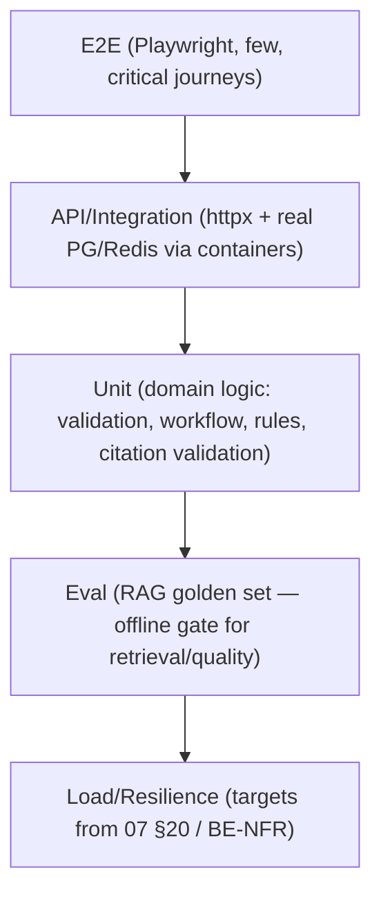

# 19 — Testing Strategy

**Related:** every document's Acceptance Criteria section; [01 §F](./01_PRODUCT_REQUIREMENTS.md); existing frontend tooling: vitest + Testing Library installed (one placeholder test), Playwright configured with zero specs (analysis §2/§21.10 — this plan gives them real jobs).
**Tooling (backend):** pytest, httpx (API), testcontainers/postgres+redis, golden-set eval harness (offline, deterministic seeds).

---

## 1. Test Pyramid

Distribution intent: ~60% unit, ~25% API/integration, ~10% eval, ~5% E2E/load. CI gates: unit+API on every PR; eval on RAG-affecting changes; E2E + load nightly/on release.

## 2. Test ID Convention

`UNIT-*`, `API-*` (incl. `API-LEG-*` frozen contract), `RET-EVAL-*` (retrieval eval), `CIT-*` (citation), `CB-*` (Context Bridge), `CONV-*`, `FORM-*`, `WF-*`, `SEC-*`, `E2E-*`, `LOAD-*`, `AUD-*`, `ERR-*`, `SRV-*`, `KB-*`, `ING-*`. AC IDs in each doc map to these ([23 Traceability Matrix](./23_TRACEABILITY_MATRIX.md)).

## 3. Layer Details & Example Cases

### 3.1 Unit (domain)
- `UNIT-VAL-001`: field-tier validation — pattern/min/max/precision per type (13 §5).
- `UNIT-WF-002`: transition guard rejects `DRAFT → SUBMITTED` (15 §4).
- `UNIT-CIT-001`: citation validator — dangling `[7]` marker → regenerate signal; hash mismatch on chunk_text → failure (07 §11.4).
- `UNIT-RULE-003`: conditional evaluation — `organization_type=manufacturer` reveals `manufacturer_license`, required=true (13 §6).
- `UNIT-REDACT-001`: audit serializer strips values/tokens (16 §6).

### 3.2 API / Integration (contract-level)
- `API-LEG-001..006` (frozen contract suite, 02 §3): exact request/response shape; `top_k` default/limits; `chunks_retrieved=0` → 200 empty; `{detail}` error shape; 504 budget honored.
- `API-CONV-001`: ask persists user+assistant rows; terminal statuses correct (10 §3).
- `API-APP-001..005`: create/patch/validate/submit happy path + 409s + idempotency replay (05 §5.8).
- `API-ADMIN-001..004`: publish gates (schema invalid → 422 SCHEMA_INVALID; publish → retrievable).

### 3.3 Database
- Migrations up/down on fresh + populated DBs; constraint tests (unique field_id per application; immutable versions — UPDATE blocked by trigger/role); HNSW present; enum integrity (04).

### 3.4 RAG / Retrieval Evaluation (golden set)
Golden dataset (versioned, admin-curated, ≥ 100 items at MVP): question → relevant chunk ids, expected answer properties, per-case tags. Metrics & gates: Recall@5 ≥ 0.8, MRR ≥ 0.6, citation precision ≥ 0.9, grounding pass ≥ 0.95 (thresholds are starting targets — tunable, recorded in eval config).

### 3.5 Critical RAG tests (mandated set)
| ID | Case |
|---|---|
| RET-EVAL-001 | correct source retrieval (known question → expected chunks in top-k) |
| RET-EVAL-002 | irrelevant source rejection (off-corpus question → zero low-quality citations, insufficient-evidence response) |
| CIT-001 | citation correctness (every `[N]` maps; every citation's chunk_text hash-matches stored chunk) |
| RET-EVAL-003 | unsupported question (invented standard → insufficient-evidence, never hallucinated) |
| RET-EVAL-004 | ambiguous question (clarification request or disclosure of ambiguity) |
| RET-EVAL-005 | conflicting sources (both cited, conflict named, `conflicting_sources`) |
| RET-EVAL-006 | outdated document (superseded version excluded by default; historical query discloses) |
| SAF-001 | prompt injection inside documents ("ignore previous instructions…") — treated as data; no behavioral change (07 §16) |
| SAF-002 | system-prompt exfiltration attempt → refusal |

### 3.6 Critical Context Bridge tests (mandated set)
| ID | Case |
|---|---|
| CB-001 | correct service context (scoped retrieval uses service documents) |
| CB-002 | correct form context (pinned form version drives validation-aware answers) |
| CB-003 | correct field context (answer references the focused field's help topic) |
| CB-STALE-004 | stale context (version mismatch → 422 CONTEXT_STALE; recovery path) |
| CB-SEC-005 | malicious context (injection payloads in question/values/labels → data-only treatment) |
| CB-LEAK-006 | context leakage between users (foreign application/conversation ids → 403/404; no cross-user data in answers) |

### 3.7 Critical form tests (mandated set)
| ID | Case |
|---|---|
| FORM-REQ-001 | required field missing → blocking error, gate READY_FOR_REVIEW |
| FORM-COND-002 | conditional field shows/hides + required enforcement server-side |
| FORM-VAL-003 | invalid value (type/pattern/bounds) → field error with overridden message |
| FORM-XF-004 | cross-field rule violation → cross_field tier error |
| FORM-DRAFT-005 | draft recovery (save → new session → values restored; multi-device conflict → 409) |
| FORM-VER-006 | form versioning (application pinned to vN unaffected by vN+1; submitted snapshot immutable) |

### 3.8 Security tests
- `SEC-AUTH-*`: brute-force lockout; session revocation on logout/password change; CSRF rejection without token.
- `SEC-AUTHZ-*`: object-level access matrix per role (06 §6) incl. admin-only routes.
- `SEC-INJ-*`: SQLi payloads in search/values; header injection; oversized envelope (64 KB cap).
- `SEC-UP-*`: malicious file upload (EICAR, polyglot, oversized) → quarantine (09 §5).
- `SEC-AI-*`: SAF-001/002 at API level; rate-limit behavior on assist.

### 3.9 Conversation tests
- `CONV-*` set from 10 §10 (persistence, failure truthfulness, memory coherence, import idempotency, regenerate).

### 3.10 Workflow / Validation tests
- `WF-*` set from 15 §9 (legal path, illegal transitions, conditional semantics, severity gating, concurrency, resume).

### 3.11 End-to-End (Playwright — new specs; the configured-but-empty suite gets real)
- `E2E-001` ask → answer → citations panel → vault save (current UX, guards the frozen contract visually).
- `E2E-002` register → login → history persists across reload.
- `E2E-003` ACTION MODE: ask → confirm service → form opens beside chat → field assist answers → save/validate → submit (mocked LLM adapter in CI).
- `E2E-004` admin: upload → ingest (stub) → publish → service visible.

### 3.12 Load
- `LOAD-001`: 20 concurrent `/search` → p95 ≤ 8 s, error rate < 1% (BE-NFR-001/004).
- `LOAD-002`: 5 concurrent assists + 20 searches mixed; `LOAD-003`: ingestion batch of 50 docs; soak 1 h for leaks.

## 4. Frontend Test Note (constraints respected)

The frontend is not this task's deliverable; however backend changes touching the frozen contract MUST run the frontend vitest suite + `API-LEG-*` contract tests against a real backend build in CI (contract-first). Frontend-side additions (when ACTION MODE work starts): zod schema derivation tests from served schemas, envelope builder tests (`lib/context-bridge.ts`), Playwright specs above.

## 5. CI Gates (summary)

| Gate | When | Blocking |
|---|---|---|
| lint + typecheck + unit | every PR | yes |
| API/integration (containers) | every PR | yes |
| `API-LEG-*` frozen suite | every PR | yes (breaks = reject) |
| RAG golden eval | RAG/prompt/model/config changes | yes (thresholds §3.4) |
| security suite (SEC-*) | every PR | yes |
| E2E + load | nightly + pre-release | release gate |
| audit/redaction checks (AUD-REDACT-*) | every PR | yes |
