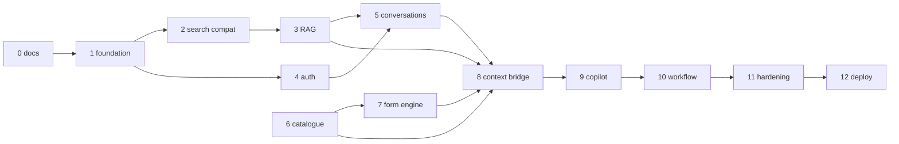

# 21 — Implementation Roadmap

**Structure:** Stages 0–12 per the project brief. Each stage: objective, dependencies, tasks, APIs, DB changes, frontend impact, tests, completion criteria. **MVP = Stages 1–8 (+10 basics); Stages 9–12 complete the SIH prototype.** Everything beyond is future scope ([00 §23](./00_PROJECT_OVERVIEW.md)).
**Rule:** the existing frontend keeps working after **every** stage (frozen `/search` contract; additive evolution).

---

## Stage 0 — Architecture & Documentation (this set)
- **Objective:** complete technical blueprint, decisions, traceability.
- **Done when:** docs 00–23 + report exist; consistency audit passed (prompt §42); open decisions logged ([22](./22_OPEN_DECISIONS.md)).
- **Tests:** none (docs). **Frontend impact:** none.

## Stage 1 — Backend Foundation
- **Objective:** runnable FastAPI skeleton with health, config, logging, CI, docker-compose, Alembic baseline.
- **Tasks:** repo layout (03 §8); settings/logging/request-id middleware; error envelope + legacy handler; CI gates (19 §5); compose (20 §1).
- **APIs:** `/health`, `GET /api/v1/health(/ready)`. **DB:** empty baseline migration; roles/permissions/sources seed.
- **Frontend impact:** none. **Tests:** health + middleware unit/API. **Done when:** CI green; compose up; readiness reflects deps.

## Stage 2 — Existing `/search` Compatibility
- **Objective:** `POST /search` honoring the frozen contract end-to-end (initially with a stub/echo RAG if knowledge isn't ready).
- **Tasks:** legacy request/response models + validation; `{detail}` errors; timeout budget; rate classes; `X-Request-ID`; `API-LEG-001..006` suite; proxy conformance test against real backend build.
- **APIs:** `POST /search` (frozen), `GET /api/v1/search` shell (501 until Stage 3). **DB:** none.
- **Frontend impact:** none (point `BIS_SIH_API_BASE_URL` at the new backend). **Tests:** API-LEG-*. **Done when:** existing frontend build runs against the new backend with zero changes (AC-001).

## Stage 3 — Real RAG Integration
- **Objective:** hybrid retrieval + generation + citation validation behind both search paths.
- **Tasks:** ingestion MVP (manual upload, digital PDF first — 09), embeddings, pgvector HNSW, RAG pipeline (07 §2–§14), golden eval harness + thresholds; provider gateways (config).
- **APIs:** `POST /api/v1/search`; admin knowledge endpoints (upload/jobs/publish/sources). **DB:** knowledge schema tables (04 §4.3), ingestion_jobs.
- **Frontend impact:** none (additive citation fields ignored). **Tests:** RET-EVAL-*, CIT-*, SAF-*, ING-*. **Done when:** eval gates pass; AC-003/004; AC-013.

## Stage 4 — Authentication
- **Objective:** real accounts + sessions + RBAC skeleton; auth injection via proxy.
- **Tasks:** Argon2id, sessions, cookies, CSRF, lockout, register/login/logout/me, password reset (mail adapter), RBAC dependencies; **frontend small change:** proxy forwards cookies (`/api/v1` handler) + minimal login UI.
- **APIs:** auth + users/me (05 §5.1–5.2). **DB:** users, sessions, roles/permissions seeds.
- **Frontend impact:** login/logout wiring (replaces toast-only logout). **Tests:** SEC-AUTH-*, API-AUTH-*. **Done when:** AC-005; protected v1 endpoints enforce 401/403.

## Stage 5 — Conversation Persistence
- **Objective:** server-side conversations with localStorage migration.
- **Tasks:** ConversationService, ask endpoint (persisted Q&A), list/detail/PATCH/delete, regenerate, import endpoint; title generation; **frontend:** dual-write then server-first sidebar (10 §8 phases 1–3).
- **APIs:** conversations + messages (05 §5.4). **DB:** conversations, messages.
- **Frontend impact:** sidebar/history restore maps to server; local store demoted to cache. **Tests:** CONV-*. **Done when:** AC-006; AC-CONV-1..5.

## Stage 6 — Service Catalogue
- **Objective:** published, admin-managed service catalogue (read APIs public).
- **Tasks:** catalogue tables + seeds (12 §7), admin CRUD/version/publish APIs, public list/detail, schema endpoint stub (409 until forms exist).
- **APIs:** services trio + admin services (05 §5.6, §5.10). **DB:** service tables (04 §4.4).
- **Frontend impact:** none mandatory; optional service discovery UI later (planned surfaces in 01 §D.4). **Tests:** SRV-*. **Done when:** AC-007; AC-SRV-1..5.

## Stage 7 — Form Engine
- **Objective:** schema-driven versioned forms end-to-end (publish → serve → render → save).
- **Tasks:** form tables + publish-time validation (13 §9), schema serving, applications CRUD with optimistic concurrency, values upserts, client-rule delivery; **frontend:** form panel on `ui/form.tsx` + primitives in the existing split (analysis §23.4), zod derivation from served rules.
- **APIs:** forms endpoints + applications CRUD (05 §5.7–5.8 minus validate/submit). **DB:** form tables, applications, application_values, application_events.
- **Frontend impact:** ACTION MODE surface (first version): Chat|Form split, draft save/resume. **Tests:** FORM-*, WF-CONC-005. **Done when:** AC-008/011; AC-FE-1..5.

## Stage 8 — Context Bridge
- **Objective:** ContextEnvelope validated end-to-end; scoped assist answers.
- **Tasks:** envelope schema + boundary validation (11 §3), identifier verification, scoped retrieval (07 §13), `/api/v1/assist`, message persistence for assist, field-focus tracking in the form panel (`lib/context-bridge.ts`).
- **APIs:** `POST /api/v1/assist` (05 §5.9). **DB:** none new (uses conversations/messages; audit).
- **Frontend impact:** envelope builder + focus tracking; assist rendering in chat with citations. **Tests:** CB-001..006. **Done when:** AC-009; AC-CB-1..6.

## Stage 9 — Form Copilot (assistance depth)
- **Objective:** full assistance behaviors + safety modes + suggestion flow.
- **Tasks:** request kinds (14 §1), allowed_operations, suggest flow with explicit Apply (PATCH with provenance), error_explain reading validation_results, uncertainty/refusal templates; UI affordances (AI-derived badges, Apply button).
- **APIs:** assist extensions (no new paths). **DB:** `updated_by_message_id` provenance (04 §4.6). **Frontend impact:** suggestion UI; error-explain links from field errors. **Tests:** COP-*, CB-SEC-005 at API. **Done when:** AC-COP-1..5; AC-014 partial (assist limits).

## Stage 10 — Validation & Workflow (complete)
- **Objective:** authoritative multi-tier validation + full state machine + submit/withdraw.
- **Tasks:** ValidationService tiers (15 §5), conditional authoritative re-evaluation, cross-field rules, document tier (warning-mode MVP), WorkflowService transitions + guards + events + audit, submit with immutability snapshot + idempotency, review UI state.
- **APIs:** validate/submit/withdraw/discard/events/validation-results (05 §5.8). **DB:** validation_results, status enum + transitions, context_snapshot.
- **Frontend impact:** review step, error surfacing, confirm dialogs. **Tests:** WF-*, FORM-XF-004, AUD-*. **Done when:** AC-010/012; AC-WF-1..6.

## Stage 11 — Testing Hardening & Security Pass
- **Objective:** full pyramid green; security suite complete; load targets verified.
- **Tasks:** E2E specs (19 §3.11), load runs (LOAD-*), security suite completion, audit/redaction checks, dependency scanning in CI, restore drill.
- **Done when:** CI gates §19.5 all green; BE-NFR-009; p95 targets measured (07 §20).

## Stage 12 — Deployment (MVP → pilot)
- **Objective:** staging + MVP prod live with observability.
- **Tasks:** environments per 20 §1, TLS/reverse proxy, backups + WAL, monitoring/alerts, runbooks (rollback, restore, secret rotation), cost dashboards.
- **Done when:** readiness-gated releases work; rollback rehearsed; alerts firing correctly; demo stable.

## MVP Boundary Call

**MVP = Stages 0–8 + Stage 10 (validation/submit) with Stage 9 included (it is the product's differentiator) and Stage 11/12 executed lightly.** Explicitly **post-MVP:** streaming, multilingual expansion, file upload for applications, regulator review, external adapter integration, vault server-sync, usage metering/billing ([00 §22–24](./00_PROJECT_OVERVIEW.md)).

## Dependency Graph (stage order is deliberate)

## Frontend Impact Summary (per stage, from the analysis)

| Stage | Frontend change | Size |
|---|---|---|
| 2 | none (env var retarget) | none |
| 4 | proxy cookie forwarding + login UI | small |
| 5 | history restore via server; local demotion | medium |
| 7 | form panel + split view + zod derivation | large (first ACTION MODE surface) |
| 8 | envelope builder + focus tracking + assist rendering | medium |
| 9 | suggestion Apply UI, AI badges | small |
| 10 | review/submit UX, error surfaces | medium |
| post | streaming renderer, multilingual, uploads | deferred |
